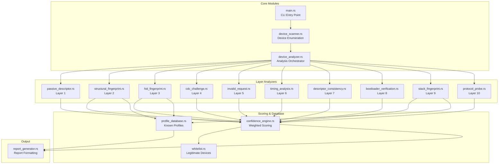
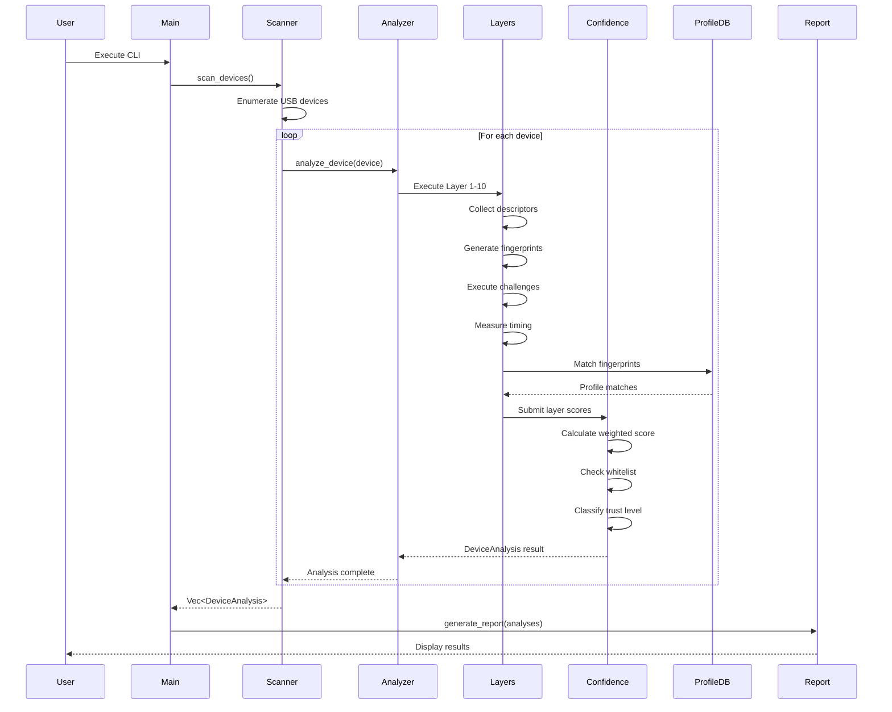
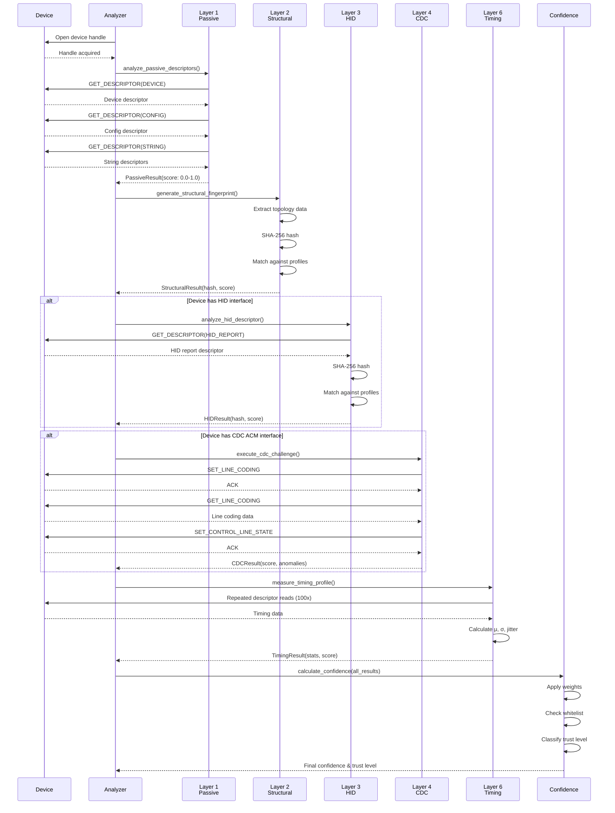
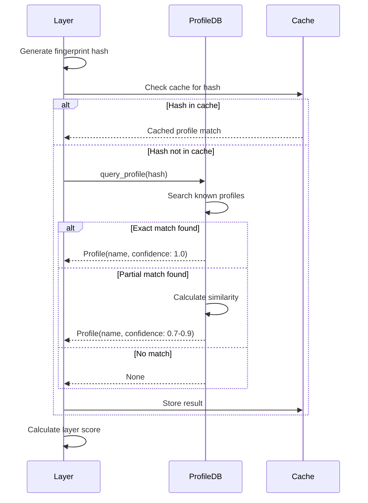

# Design: Advanced USB Fingerprinting System

## Overview

### Purpose

This design document specifies the architecture and implementation details for transforming the Rust Probe detection system from a simple VID/PID-based validator into a sophisticated multi-layer USB fingerprinting engine. The system will detect advanced spoofing techniques used in Arduino, ESP32, Teensy, and other development boards attempting to masquerade as legitimate peripherals.

### Scope

The system implements a 12-layer behavioral and structural fingerprinting architecture that analyzes USB devices through:
- Passive descriptor collection and validation
- Structural topology fingerprinting (cryptographic hashing)
- HID report descriptor analysis
- Active USB protocol challenges (CDC ACM)
- Invalid request testing for error handling analysis
- Timing characteristic profiling
- Descriptor consistency verification
- Bootloader behavior validation
- USB stack identification
- Protocol-specific probes
- Weighted confidence scoring
- False positive reduction through behavioral whitelisting

### Key Design Decisions

**1. Multi-Layer Architecture**: Each layer operates independently and contributes a weighted score to the final confidence calculation. This allows graceful degradation when certain layers cannot be executed (e.g., device doesn't support CDC ACM).

**2. Cryptographic Fingerprinting**: Using SHA-256 hashing of structural characteristics creates deterministic, collision-resistant fingerprints that are independent of easily-spoofable string descriptors.

**3. Weighted Scoring System**: Replacing binary trust levels with a 0.0-1.0 confidence score provides nuanced classification and reduces false positives.

**4. Behavioral Whitelisting**: Known-good device profiles prevent legitimate peripherals from being flagged, addressing the false positive problem.

**5. Stack-Agnostic Detection**: The system identifies USB firmware stacks (LUFA, TinyUSB, ESP-IDF) through behavioral signatures rather than relying on descriptor strings.


## Architecture

### System Architecture Overview

The system follows a pipeline architecture where each layer processes device data and contributes to the final confidence score:

```
┌─────────────────────────────────────────────────────────────────┐
│                        USB Device Input                          │
└────────────────────────────┬────────────────────────────────────┘
                             │
                             ▼
┌─────────────────────────────────────────────────────────────────┐
│                    Device Enumeration Layer                      │
│  (rusb library - device detection and descriptor reading)       │
└────────────────────────────┬────────────────────────────────────┘
                             │
                             ▼
┌─────────────────────────────────────────────────────────────────┐
│                   12-Layer Analysis Pipeline                     │
│                                                                   │
│  ┌─────────────────────────────────────────────────────────┐   │
│  │ Layer 1: Passive Descriptor Validation (15% weight)     │   │
│  └─────────────────────────────────────────────────────────┘   │
│  ┌─────────────────────────────────────────────────────────┐   │
│  │ Layer 2: Structural Fingerprint (25% weight)            │   │
│  └─────────────────────────────────────────────────────────┘   │
│  ┌─────────────────────────────────────────────────────────┐   │
│  │ Layer 3: HID Descriptor Fingerprint (30% weight)        │   │
│  └─────────────────────────────────────────────────────────┘   │
│  ┌─────────────────────────────────────────────────────────┐   │
│  │ Layer 4: Active CDC Challenge (15% weight)              │   │
│  └─────────────────────────────────────────────────────────┘   │
│  ┌─────────────────────────────────────────────────────────┐   │
│  │ Layer 5: Invalid Request Challenge (5% weight)          │   │
│  └─────────────────────────────────────────────────────────┘   │
│  ┌─────────────────────────────────────────────────────────┐   │
│  │ Layer 6: Timing Fingerprinting (10% weight)             │   │
│  └─────────────────────────────────────────────────────────┘   │
│  ┌─────────────────────────────────────────────────────────┐   │
│  │ Layer 7: Descriptor Consistency (5% weight)             │   │
│  └─────────────────────────────────────────────────────────┘   │
│  ┌─────────────────────────────────────────────────────────┐   │
│  │ Layer 8: Bootloader Verification (10% weight)           │   │
│  └─────────────────────────────────────────────────────────┘   │
│  ┌─────────────────────────────────────────────────────────┐   │
│  │ Layer 9: Stack Fingerprinting (15% weight)              │   │
│  └─────────────────────────────────────────────────────────┘   │
│  ┌─────────────────────────────────────────────────────────┐   │
│  │ Layer 10: Protocol Probe (5% weight)                    │   │
│  └─────────────────────────────────────────────────────────┘   │
│                                                                   │
└────────────────────────────┬────────────────────────────────────┘
                             │
                             ▼
┌─────────────────────────────────────────────────────────────────┐
│                   Confidence Scoring Engine                      │
│  - Weighted score calculation                                    │
│  - Whitelist matching                                            │
│  - Multi-factor anomaly detection                                │
│  - Trust level classification                                    │
└────────────────────────────┬────────────────────────────────────┘
                             │
                             ▼
┌─────────────────────────────────────────────────────────────────┐
│                      Report Generation                           │
│  - Per-layer results                                             │
│  - Confidence score                                              │
│  - Trust level classification                                    │
│  - Anomaly details                                               │
└─────────────────────────────────────────────────────────────────┘
```

### Component Diagram



### Data Flow Diagram



### Sequence Diagram: Device Analysis Workflow



### Sequence Diagram: Fingerprint Matching




## Components and Interfaces

### Module Breakdown

#### 1. Core Modules

**main.rs** - CLI Entry Point
- Responsibilities:
  - Parse command-line arguments
  - Initialize USB context
  - Orchestrate device scanning
  - Display results
- Dependencies: `device_scanner`, `report_generator`
- Interface:
  ```rust
  fn main() -> Result<(), Error>
  ```

**device_scanner.rs** - Device Enumeration
- Responsibilities:
  - Enumerate all USB devices
  - Filter devices for analysis
  - Coordinate device analysis
- Dependencies: `rusb`, `device_analyzer`
- Interface:
  ```rust
  pub struct DeviceScanner {
      context: rusb::Context,
  }
  
  impl DeviceScanner {
      pub fn new(context: rusb::Context) -> Self;
      pub fn scan_devices(&self) -> Result<Vec<DeviceAnalysis>, Error>;
      pub fn scan_all_devices(&self) -> Result<Vec<(u16, u16, u8)>, Error>;
  }
  ```

**device_analyzer.rs** - Analysis Orchestrator
- Responsibilities:
  - Coordinate execution of all 12 layers
  - Aggregate layer results
  - Handle device access errors
  - Manage analysis timeouts
- Dependencies: All layer modules, `confidence_engine`
- Interface:
  ```rust
  pub struct DeviceAnalyzer {
      profile_db: Arc<ProfileDatabase>,
      whitelist: Arc<Whitelist>,
  }
  
  impl DeviceAnalyzer {
      pub fn new(profile_db: Arc<ProfileDatabase>, whitelist: Arc<Whitelist>) -> Self;
      pub fn analyze(&self, device: &Device<Context>) -> Result<DeviceAnalysis, Error>;
  }
  ```

#### 2. Layer Analyzer Modules

**layers/passive_descriptor.rs** - Layer 1
- Responsibilities:
  - Read all USB descriptors
  - Extract VID, PID, strings
  - Validate descriptor structure
- Interface:
  ```rust
  pub struct PassiveDescriptorAnalyzer;
  
  impl PassiveDescriptorAnalyzer {
      pub fn analyze(&self, device: &Device<Context>) -> Result<PassiveResult, Error>;
  }
  
  pub struct PassiveResult {
      pub vid: u16,
      pub pid: u16,
      pub manufacturer: Option<String>,
      pub product: Option<String>,
      pub serial: Option<String>,
      pub device_class: u8,
      pub device_subclass: u8,
      pub device_protocol: u8,
      pub usb_version: (u8, u8),
      pub device_version: (u8, u8),
      pub num_configurations: u8,
      pub max_packet_size: u8,
      pub score: f32,  // 0.0-1.0
      pub anomalies: Vec<String>,
  }
  ```

**layers/structural_fingerprint.rs** - Layer 2
- Responsibilities:
  - Extract USB topology structure
  - Generate SHA-256 fingerprint
  - Match against known profiles
- Interface:
  ```rust
  pub struct StructuralFingerprintAnalyzer {
      profile_db: Arc<ProfileDatabase>,
  }
  
  impl StructuralFingerprintAnalyzer {
      pub fn analyze(&self, device: &Device<Context>) -> Result<StructuralResult, Error>;
      fn extract_topology(&self, device: &Device<Context>) -> Result<TopologyData, Error>;
      fn generate_fingerprint(&self, topology: &TopologyData) -> [u8; 32];
  }
  
  pub struct TopologyData {
      pub num_interfaces: u8,
      pub interface_classes: Vec<u8>,
      pub endpoint_addresses: Vec<u8>,
      pub endpoint_types: Vec<TransferType>,
      pub endpoint_directions: Vec<Direction>,
      pub endpoint_max_packet_sizes: Vec<u16>,
      pub endpoint_intervals: Vec<u8>,
      pub has_iad: bool,
      pub cdc_functional_descriptors: Vec<u8>,
  }
  
  pub struct StructuralResult {
      pub fingerprint_hash: [u8; 32],
      pub matched_profile: Option<String>,
      pub similarity: f32,
      pub score: f32,
      pub topology: TopologyData,
  }
  ```

**layers/hid_fingerprint.rs** - Layer 3
- Responsibilities:
  - Detect HID interfaces
  - Read HID report descriptor
  - Generate SHA-256 fingerprint
  - Match against known HID profiles
- Interface:
  ```rust
  pub struct HIDFingerprintAnalyzer {
      profile_db: Arc<ProfileDatabase>,
  }
  
  impl HIDFingerprintAnalyzer {
      pub fn analyze(&self, device: &Device<Context>) -> Result<Option<HIDResult>, Error>;
      fn read_hid_report_descriptor(&self, handle: &DeviceHandle<Context>, interface: u8) 
          -> Result<Vec<u8>, Error>;
  }
  
  pub struct HIDResult {
      pub interface_number: u8,
      pub report_descriptor: Vec<u8>,
      pub fingerprint_hash: [u8; 32],
      pub matched_profile: Option<String>,
      pub similarity: f32,
      pub score: f32,
      pub usage_page: Option<u16>,
      pub usage: Option<u16>,
      pub anomalies: Vec<String>,
  }
  ```

**layers/cdc_challenge.rs** - Layer 4
- Responsibilities:
  - Detect CDC ACM interfaces
  - Execute SET_LINE_CODING request
  - Execute GET_LINE_CODING request
  - Execute SET_CONTROL_LINE_STATE request
  - Measure response timing
  - Validate response format
- Interface:
  ```rust
  pub struct CDCChallengeAnalyzer;
  
  impl CDCChallengeAnalyzer {
      pub fn analyze(&self, device: &Device<Context>) -> Result<Option<CDCResult>, Error>;
      fn execute_set_line_coding(&self, handle: &DeviceHandle<Context>, interface: u8, 
          line_coding: &LineCoding) -> Result<Duration, Error>;
      fn execute_get_line_coding(&self, handle: &DeviceHandle<Context>, interface: u8) 
          -> Result<(LineCoding, Duration), Error>;
      fn execute_set_control_line_state(&self, handle: &DeviceHandle<Context>, interface: u8, 
          dtr: bool, rts: bool) -> Result<Duration, Error>;
  }
  
  pub struct LineCoding {
      pub dte_rate: u32,      // Baud rate
      pub char_format: u8,    // Stop bits
      pub parity_type: u8,    // Parity
      pub data_bits: u8,      // Data bits
  }
  
  pub struct CDCResult {
      pub interface_number: u8,
      pub set_line_coding_success: bool,
      pub get_line_coding_success: bool,
      pub set_control_line_state_success: bool,
      pub line_coding_roundtrip_valid: bool,
      pub timing_stats: TimingStats,
      pub score: f32,
      pub anomalies: Vec<String>,
  }
  ```

**layers/invalid_request.rs** - Layer 5
- Responsibilities:
  - Send invalid descriptor type requests
  - Send requests with invalid wLength
  - Send malformed control transfers
  - Analyze error handling behavior
- Interface:
  ```rust
  pub struct InvalidRequestAnalyzer;
  
  impl InvalidRequestAnalyzer {
      pub fn analyze(&self, device: &Device<Context>) -> Result<InvalidRequestResult, Error>;
      fn test_invalid_descriptor_type(&self, handle: &DeviceHandle<Context>) 
          -> RequestResponse;
      fn test_invalid_wlength(&self, handle: &DeviceHandle<Context>) -> RequestResponse;
      fn test_invalid_request_code(&self, handle: &DeviceHandle<Context>) -> RequestResponse;
  }
  
  pub enum RequestResponse {
      Stall,
      Timeout,
      ValidData(Vec<u8>),
      DeviceDisconnect,
      UnexpectedAck,
  }
  
  pub struct InvalidRequestResult {
      pub invalid_descriptor_response: RequestResponse,
      pub invalid_wlength_response: RequestResponse,
      pub invalid_request_response: RequestResponse,
      pub score: f32,
      pub anomalies: Vec<String>,
  }
  ```

**layers/timing_analysis.rs** - Layer 6
- Responsibilities:
  - Measure enumeration latency
  - Measure descriptor read latency
  - Measure control transfer latency
  - Perform 100 repeated reads
  - Calculate statistics (μ, σ, jitter)
- Interface:
  ```rust
  pub struct TimingAnalyzer;
  
  impl TimingAnalyzer {
      pub fn analyze(&self, device: &Device<Context>) -> Result<TimingResult, Error>;
      fn measure_repeated_reads(&self, handle: &DeviceHandle<Context>, iterations: usize) 
          -> Vec<Duration>;
      fn calculate_statistics(&self, timings: &[Duration]) -> TimingStats;
  }
  
  pub struct TimingStats {
      pub mean_us: u64,
      pub std_dev_us: u64,
      pub min_us: u64,
      pub max_us: u64,
      pub jitter_us: u64,
      pub variance: f64,
  }
  
  pub struct TimingResult {
      pub enumeration_latency_us: u64,
      pub descriptor_read_stats: TimingStats,
      pub control_transfer_stats: TimingStats,
      pub repeated_read_stats: TimingStats,
      pub score: f32,
      pub is_consistent: bool,
      pub anomalies: Vec<String>,
  }
  ```

**layers/descriptor_consistency.rs** - Layer 7
- Responsibilities:
  - Read same descriptor 100 times
  - Verify size consistency
  - Verify content consistency (byte-by-byte)
  - Calculate checksums (CRC32)
- Interface:
  ```rust
  pub struct DescriptorConsistencyAnalyzer;
  
  impl DescriptorConsistencyAnalyzer {
      pub fn analyze(&self, device: &Device<Context>) -> Result<ConsistencyResult, Error>;
      fn read_descriptor_repeatedly(&self, handle: &DeviceHandle<Context>, 
          descriptor_type: u8, iterations: usize) -> Vec<Vec<u8>>;
      fn verify_consistency(&self, descriptors: &[Vec<u8>]) -> bool;
  }
  
  pub struct ConsistencyResult {
      pub iterations: usize,
      pub size_consistent: bool,
      pub content_consistent: bool,
      pub checksums: Vec<u32>,
      pub score: f32,
      pub anomalies: Vec<String>,
  }
  ```

**layers/bootloader_verification.rs** - Layer 8
- Responsibilities:
  - Detect devices claiming Arduino Leonardo identity
  - Execute Caterina bootloader validation (1200 baud reset)
  - Detect devices claiming Teensy identity
  - Execute Teensy HID bootloader validation
  - Measure timing profiles
- Interface:
  ```rust
  pub struct BootloaderVerifier;
  
  impl BootloaderVerifier {
      pub fn analyze(&self, device: &Device<Context>, passive_result: &PassiveResult) 
          -> Result<Option<BootloaderResult>, Error>;
      fn test_caterina_bootloader(&self, device: &Device<Context>) 
          -> Result<CaterinaResult, Error>;
      fn test_teensy_bootloader(&self, device: &Device<Context>) 
          -> Result<TeensyResult, Error>;
  }
  
  pub struct CaterinaResult {
      pub reset_triggered: bool,
      pub reenumerated: bool,
      pub bootloader_vid_pid_correct: bool,
      pub timing_ms: u64,
      pub timing_in_range: bool,  // 650-850ms
  }
  
  pub struct BootloaderResult {
      pub bootloader_type: BootloaderType,
      pub validation_passed: bool,
      pub score: f32,
      pub details: String,
      pub anomalies: Vec<String>,
  }
  
  pub enum BootloaderType {
      Caterina,
      Teensy,
      Unknown,
  }
  ```

**layers/stack_fingerprint.rs** - Layer 9
- Responsibilities:
  - Analyze descriptor ordering patterns
  - Analyze callback behavior patterns
  - Analyze endpoint structure patterns
  - Analyze timing profiles
  - Detect CDC-specific quirks
  - Classify probable USB stack
- Interface:
  ```rust
  pub struct StackFingerprintAnalyzer;
  
  impl StackFingerprintAnalyzer {
      pub fn analyze(&self, device: &Device<Context>, 
          structural: &StructuralResult, 
          timing: &TimingResult) -> Result<StackResult, Error>;
      fn detect_lufa_signatures(&self, topology: &TopologyData) -> f32;
      fn detect_tinyusb_signatures(&self, topology: &TopologyData) -> f32;
      fn detect_esp_idf_signatures(&self, topology: &TopologyData) -> f32;
  }
  
  pub struct StackResult {
      pub detected_stack: Option<USBStack>,
      pub confidence: f32,
      pub score: f32,
      pub signatures: Vec<String>,
  }
  
  pub enum USBStack {
      LUFA,
      TinyUSB,
      ESPIDF,
      ArduinoAVR,
      STM32Cube,
      Zephyr,
      PJRC,
      Unknown,
  }
  ```

**layers/protocol_probe.rs** - Layer 10
- Responsibilities:
  - Execute Arduino protocol probes (STK500, AVR109)
  - Execute ESP protocol probes (ROM bootloader sync)
  - Execute Teensy protocol probes
  - Measure responses
- Interface:
  ```rust
  pub struct ProtocolProber;
  
  impl ProtocolProber {
      pub fn analyze(&self, device: &Device<Context>, passive_result: &PassiveResult) 
          -> Result<ProtocolResult, Error>;
      fn probe_stk500(&self, handle: &DeviceHandle<Context>) -> ProbeResponse;
      fn probe_esp_bootloader(&self, handle: &DeviceHandle<Context>) -> ProbeResponse;
      fn probe_teensy_hid(&self, handle: &DeviceHandle<Context>) -> ProbeResponse;
  }
  
  pub enum ProbeResponse {
      Responded(Vec<u8>),
      NoResponse,
      InvalidResponse,
      Error(String),
  }
  
  pub struct ProtocolResult {
      pub arduino_probe: ProbeResponse,
      pub esp_probe: ProbeResponse,
      pub teensy_probe: ProbeResponse,
      pub score: f32,
      pub detected_protocol: Option<String>,
  }
  ```

#### 3. Scoring & Database Modules

**confidence_engine.rs** - Weighted Scoring
- Responsibilities:
  - Calculate weighted confidence score
  - Check whitelist matches
  - Require multi-factor anomalies
  - Classify trust level
- Interface:
  ```rust
  pub struct ConfidenceEngine {
      whitelist: Arc<Whitelist>,
  }
  
  impl ConfidenceEngine {
      pub fn calculate_confidence(&self, results: &LayerResults) -> ConfidenceScore;
      fn apply_weights(&self, results: &LayerResults) -> f32;
      fn check_whitelist(&self, results: &LayerResults) -> bool;
      fn classify_trust_level(&self, confidence: f32, anomaly_count: usize) -> TrustLevel;
  }
  
  pub struct LayerResults {
      pub passive: PassiveResult,
      pub structural: StructuralResult,
      pub hid: Option<HIDResult>,
      pub cdc: Option<CDCResult>,
      pub invalid_request: InvalidRequestResult,
      pub timing: TimingResult,
      pub consistency: ConsistencyResult,
      pub bootloader: Option<BootloaderResult>,
      pub stack: StackResult,
      pub protocol: ProtocolResult,
  }
  
  pub struct ConfidenceScore {
      pub overall: f32,  // 0.0-1.0
      pub passive_score: f32,
      pub structural_score: f32,
      pub hid_score: f32,
      pub active_score: f32,
      pub stack_score: f32,
      pub protocol_score: f32,
      pub trust_level: TrustLevel,
      pub anomaly_count: usize,
      pub whitelist_match: bool,
  }
  
  pub enum TrustLevel {
      Genuine,           // ≥ 0.85
      BoardModified,     // 0.60 - 0.85
      VidPidSpoofed,     // 0.30 - 0.60
      DeepModification,  // 0.10 - 0.30
      Unknown,           // < 0.10
  }
  ```

**profile_database.rs** - Known Profiles
- Responsibilities:
  - Store known device profiles
  - Match fingerprints against profiles
  - Calculate similarity scores
  - Cache profile lookups
- Interface:
  ```rust
  pub struct ProfileDatabase {
      structural_profiles: HashMap<[u8; 32], DeviceProfile>,
      hid_profiles: HashMap<[u8; 32], HIDProfile>,
      stack_signatures: HashMap<USBStack, StackSignature>,
      cache: Arc<Mutex<LruCache<[u8; 32], ProfileMatch>>>,
  }
  
  impl ProfileDatabase {
      pub fn new() -> Self;
      pub fn load_from_file(path: &Path) -> Result<Self, Error>;
      pub fn match_structural(&self, hash: &[u8; 32]) -> Option<ProfileMatch>;
      pub fn match_hid(&self, hash: &[u8; 32]) -> Option<ProfileMatch>;
      pub fn match_stack(&self, topology: &TopologyData) -> Option<USBStack>;
  }
  
  pub struct DeviceProfile {
      pub name: String,
      pub vendor: String,
      pub fingerprint: [u8; 32],
      pub topology: TopologyData,
      pub stack: Option<USBStack>,
  }
  
  pub struct HIDProfile {
      pub name: String,
      pub device_type: HIDDeviceType,
      pub fingerprint: [u8; 32],
      pub report_descriptor: Vec<u8>,
      pub usage_page: u16,
      pub usage: u16,
  }
  
  pub enum HIDDeviceType {
      Keyboard,
      Mouse,
      Gamepad,
      ArduinoLUFA,
      TinyUSB,
      ESP32,
      Teensy,
  }
  
  pub struct StackSignature {
      pub stack: USBStack,
      pub descriptor_ordering: Vec<u8>,
      pub endpoint_pattern: Vec<u8>,
      pub timing_profile: TimingProfile,
  }
  
  pub struct ProfileMatch {
      pub profile_name: String,
      pub similarity: f32,  // 0.0-1.0
  }
  ```

**whitelist.rs** - Legitimate Devices
- Responsibilities:
  - Store behavioral whitelist profiles
  - Match devices against whitelist
  - Prevent false positives
- Interface:
  ```rust
  pub struct Whitelist {
      profiles: Vec<WhitelistProfile>,
  }
  
  impl Whitelist {
      pub fn new() -> Self;
      pub fn load_from_file(path: &Path) -> Result<Self, Error>;
      pub fn is_whitelisted(&self, results: &LayerResults) -> bool;
      fn match_profile(&self, results: &LayerResults, profile: &WhitelistProfile) -> bool;
  }
  
  pub struct WhitelistProfile {
      pub name: String,
      pub vendor: String,
      pub structural_fingerprint: Option<[u8; 32]>,
      pub hid_fingerprint: Option<[u8; 32]>,
      pub vid_range: Option<(u16, u16)>,
      pub allowed_anomalies: Vec<String>,
  }
  ```

#### 4. Output Module

**report_generator.rs** - Report Formatting
- Responsibilities:
  - Format device analysis results
  - Display per-layer scores
  - Display confidence score
  - Display trust level
  - Color-code results
  - Generate statistics
- Interface:
  ```rust
  pub struct ReportGenerator;
  
  impl ReportGenerator {
      pub fn new() -> Self;
      pub fn print_device_report(&self, analysis: &DeviceAnalysis);
      pub fn print_statistics(&self, analyses: &[DeviceAnalysis]);
      pub fn export_json(&self, analyses: &[DeviceAnalysis]) -> Result<String, Error>;
  }
  
  pub struct DeviceAnalysis {
      pub bus: u8,
      pub address: u8,
      pub passive: PassiveResult,
      pub structural: StructuralResult,
      pub hid: Option<HIDResult>,
      pub cdc: Option<CDCResult>,
      pub invalid_request: InvalidRequestResult,
      pub timing: TimingResult,
      pub consistency: ConsistencyResult,
      pub bootloader: Option<BootloaderResult>,
      pub stack: StackResult,
      pub protocol: ProtocolResult,
      pub confidence: ConfidenceScore,
  }
  ```


## Data Models

### Core Data Structures

#### UsbFingerprint

```rust
/// Complete USB device fingerprint containing all layer results
pub struct UsbFingerprint {
    /// SHA-256 hash of structural topology
    pub structural_hash: [u8; 32],
    
    /// SHA-256 hash of HID report descriptor (if applicable)
    pub hid_hash: Option<[u8; 32]>,
    
    /// Timing profile statistics
    pub timing_profile: TimingProfile,
    
    /// Detected USB stack
    pub detected_stack: Option<USBStack>,
    
    /// Bootloader signature (if applicable)
    pub bootloader_signature: Option<BootloaderSignature>,
    
    /// Protocol responses
    pub protocol_responses: ProtocolResponses,
}

impl UsbFingerprint {
    /// Create a new fingerprint from layer results
    pub fn from_layer_results(results: &LayerResults) -> Self {
        Self {
            structural_hash: results.structural.fingerprint_hash,
            hid_hash: results.hid.as_ref().map(|h| h.fingerprint_hash),
            timing_profile: TimingProfile::from_timing_result(&results.timing),
            detected_stack: results.stack.detected_stack.clone(),
            bootloader_signature: results.bootloader.as_ref()
                .map(|b| BootloaderSignature::from_result(b)),
            protocol_responses: ProtocolResponses::from_result(&results.protocol),
        }
    }
    
    /// Compare this fingerprint with another for similarity
    pub fn similarity(&self, other: &UsbFingerprint) -> f32 {
        let mut score = 0.0;
        let mut weight_sum = 0.0;
        
        // Structural hash comparison (weight: 0.4)
        if self.structural_hash == other.structural_hash {
            score += 0.4;
        }
        weight_sum += 0.4;
        
        // HID hash comparison (weight: 0.3)
        if let (Some(h1), Some(h2)) = (&self.hid_hash, &other.hid_hash) {
            if h1 == h2 {
                score += 0.3;
            }
            weight_sum += 0.3;
        }
        
        // Timing profile similarity (weight: 0.2)
        score += self.timing_profile.similarity(&other.timing_profile) * 0.2;
        weight_sum += 0.2;
        
        // Stack match (weight: 0.1)
        if self.detected_stack == other.detected_stack {
            score += 0.1;
        }
        weight_sum += 0.1;
        
        score / weight_sum
    }
}
```

#### TimingProfile

```rust
/// Timing characteristics of a USB device
#[derive(Debug, Clone, Serialize, Deserialize)]
pub struct TimingProfile {
    /// Mean response time in microseconds
    pub mean_us: u64,
    
    /// Standard deviation in microseconds
    pub std_dev_us: u64,
    
    /// Minimum response time
    pub min_us: u64,
    
    /// Maximum response time
    pub max_us: u64,
    
    /// Jitter (max - min)
    pub jitter_us: u64,
    
    /// Variance
    pub variance: f64,
    
    /// Enumeration latency
    pub enumeration_latency_us: u64,
}

impl TimingProfile {
    pub fn from_timing_result(result: &TimingResult) -> Self {
        Self {
            mean_us: result.repeated_read_stats.mean_us,
            std_dev_us: result.repeated_read_stats.std_dev_us,
            min_us: result.repeated_read_stats.min_us,
            max_us: result.repeated_read_stats.max_us,
            jitter_us: result.repeated_read_stats.jitter_us,
            variance: result.repeated_read_stats.variance,
            enumeration_latency_us: result.enumeration_latency_us,
        }
    }
    
    /// Calculate similarity between two timing profiles
    pub fn similarity(&self, other: &TimingProfile) -> f32 {
        // Compare standard deviations (lower difference = higher similarity)
        let std_dev_diff = (self.std_dev_us as f64 - other.std_dev_us as f64).abs();
        let std_dev_similarity = 1.0 - (std_dev_diff / self.std_dev_us.max(other.std_dev_us) as f64).min(1.0);
        
        // Compare jitter
        let jitter_diff = (self.jitter_us as f64 - other.jitter_us as f64).abs();
        let jitter_similarity = 1.0 - (jitter_diff / self.jitter_us.max(other.jitter_us) as f64).min(1.0);
        
        ((std_dev_similarity + jitter_similarity) / 2.0) as f32
    }
    
    /// Classify timing profile as real hardware, emulated, or proxied
    pub fn classify(&self) -> TimingClassification {
        if self.std_dev_us < 5000 {
            TimingClassification::RealHardware
        } else if self.std_dev_us > 20000 {
            TimingClassification::Emulated
        } else if self.jitter_us > 50000 {
            TimingClassification::Proxied
        } else {
            TimingClassification::Unknown
        }
    }
}

#[derive(Debug, Clone, PartialEq)]
pub enum TimingClassification {
    RealHardware,
    Emulated,
    Proxied,
    Unknown,
}
```

#### LayerResult

```rust
/// Generic result structure for each analysis layer
pub trait LayerResult {
    /// Get the score for this layer (0.0-1.0)
    fn score(&self) -> f32;
    
    /// Get anomalies detected by this layer
    fn anomalies(&self) -> &[String];
    
    /// Get evidence supporting the score
    fn evidence(&self) -> Vec<String>;
}

/// Aggregated results from all layers
pub struct AggregatedLayerResults {
    pub layer_scores: HashMap<LayerType, f32>,
    pub layer_anomalies: HashMap<LayerType, Vec<String>>,
    pub layer_evidence: HashMap<LayerType, Vec<String>>,
}

#[derive(Debug, Clone, Copy, PartialEq, Eq, Hash)]
pub enum LayerType {
    PassiveDescriptor,
    StructuralFingerprint,
    HIDFingerprint,
    CDCChallenge,
    InvalidRequest,
    TimingAnalysis,
    DescriptorConsistency,
    BootloaderVerification,
    StackFingerprinting,
    ProtocolProbe,
}

impl AggregatedLayerResults {
    pub fn new() -> Self {
        Self {
            layer_scores: HashMap::new(),
            layer_anomalies: HashMap::new(),
            layer_evidence: HashMap::new(),
        }
    }
    
    pub fn add_layer<T: LayerResult>(&mut self, layer_type: LayerType, result: &T) {
        self.layer_scores.insert(layer_type, result.score());
        self.layer_anomalies.insert(layer_type, result.anomalies().to_vec());
        self.layer_evidence.insert(layer_type, result.evidence());
    }
    
    pub fn total_anomaly_count(&self) -> usize {
        self.layer_anomalies.values().map(|v| v.len()).sum()
    }
}
```

#### DeviceProfile

```rust
/// Known device profile for fingerprint matching
#[derive(Debug, Clone, Serialize, Deserialize)]
pub struct DeviceProfile {
    /// Profile identifier
    pub id: String,
    
    /// Human-readable name
    pub name: String,
    
    /// Vendor name
    pub vendor: String,
    
    /// Device category
    pub category: DeviceCategory,
    
    /// Structural fingerprint
    pub structural_fingerprint: [u8; 32],
    
    /// HID fingerprint (if applicable)
    pub hid_fingerprint: Option<[u8; 32]>,
    
    /// Expected USB stack
    pub expected_stack: Option<USBStack>,
    
    /// Expected timing profile
    pub timing_profile: Option<TimingProfile>,
    
    /// Known VID/PID combinations
    pub vid_pid_combinations: Vec<(u16, u16)>,
    
    /// Profile metadata
    pub metadata: ProfileMetadata,
}

#[derive(Debug, Clone, Serialize, Deserialize)]
pub struct ProfileMetadata {
    pub created_at: String,
    pub updated_at: String,
    pub version: String,
    pub confidence_threshold: f32,
}

#[derive(Debug, Clone, PartialEq, Serialize, Deserialize)]
pub enum DeviceCategory {
    ArduinoLeonardo,
    ArduinoMicro,
    ArduinoUno,
    ArduinoMega,
    ESP32S3,
    ESP32S2,
    Teensy3x,
    Teensy4x,
    LogitechMouse,
    LogitechKeyboard,
    MicrosoftMouse,
    MicrosoftKeyboard,
    CP2102Serial,
    FTDISerial,
    CH340Serial,
    GenericHID,
    GenericCDC,
    Unknown,
}

impl DeviceProfile {
    /// Load profiles from JSON file
    pub fn load_database(path: &Path) -> Result<Vec<DeviceProfile>, Error> {
        let file = File::open(path)?;
        let profiles: Vec<DeviceProfile> = serde_json::from_reader(file)?;
        Ok(profiles)
    }
    
    /// Match a fingerprint against this profile
    pub fn matches(&self, fingerprint: &UsbFingerprint) -> ProfileMatch {
        let mut similarity = 0.0;
        let mut weight_sum = 0.0;
        
        // Structural fingerprint match (weight: 0.5)
        if self.structural_fingerprint == fingerprint.structural_hash {
            similarity += 0.5;
        }
        weight_sum += 0.5;
        
        // HID fingerprint match (weight: 0.3)
        if let (Some(profile_hid), Some(device_hid)) = 
            (&self.hid_fingerprint, &fingerprint.hid_hash) {
            if profile_hid == device_hid {
                similarity += 0.3;
            }
            weight_sum += 0.3;
        }
        
        // Stack match (weight: 0.1)
        if self.expected_stack == fingerprint.detected_stack {
            similarity += 0.1;
        }
        weight_sum += 0.1;
        
        // Timing profile match (weight: 0.1)
        if let Some(ref profile_timing) = self.timing_profile {
            similarity += profile_timing.similarity(&fingerprint.timing_profile) as f64 * 0.1;
            weight_sum += 0.1;
        }
        
        let final_similarity = (similarity / weight_sum) as f32;
        
        ProfileMatch {
            profile_name: self.name.clone(),
            profile_id: self.id.clone(),
            similarity: final_similarity,
            matched: final_similarity >= self.metadata.confidence_threshold,
        }
    }
}
```

#### ConfidenceScore

```rust
/// Weighted confidence score from all layers
#[derive(Debug, Clone, Serialize, Deserialize)]
pub struct ConfidenceScore {
    /// Overall confidence (0.0-1.0)
    pub overall: f32,
    
    /// Per-layer scores
    pub passive_score: f32,
    pub structural_score: f32,
    pub hid_score: f32,
    pub active_score: f32,
    pub stack_score: f32,
    pub protocol_score: f32,
    
    /// Trust level classification
    pub trust_level: TrustLevel,
    
    /// Total anomaly count
    pub anomaly_count: usize,
    
    /// Whitelist match status
    pub whitelist_match: bool,
    
    /// Matched profile (if any)
    pub matched_profile: Option<String>,
}

impl ConfidenceScore {
    /// Calculate overall confidence from layer scores
    pub fn calculate(results: &LayerResults, whitelist_match: bool) -> Self {
        // Weight configuration
        const PASSIVE_WEIGHT: f32 = 0.15;
        const STRUCTURAL_WEIGHT: f32 = 0.25;
        const HID_WEIGHT: f32 = 0.30;
        const ACTIVE_WEIGHT: f32 = 0.15;
        const STACK_WEIGHT: f32 = 0.10;
        const PROTOCOL_WEIGHT: f32 = 0.05;
        
        let passive_score = results.passive.score;
        let structural_score = results.structural.score;
        let hid_score = results.hid.as_ref().map(|h| h.score).unwrap_or(0.0);
        let active_score = Self::calculate_active_score(results);
        let stack_score = results.stack.score;
        let protocol_score = results.protocol.score;
        
        // Calculate weighted overall score
        let mut overall = 0.0;
        let mut total_weight = 0.0;
        
        overall += passive_score * PASSIVE_WEIGHT;
        total_weight += PASSIVE_WEIGHT;
        
        overall += structural_score * STRUCTURAL_WEIGHT;
        total_weight += STRUCTURAL_WEIGHT;
        
        if results.hid.is_some() {
            overall += hid_score * HID_WEIGHT;
            total_weight += HID_WEIGHT;
        }
        
        overall += active_score * ACTIVE_WEIGHT;
        total_weight += ACTIVE_WEIGHT;
        
        overall += stack_score * STACK_WEIGHT;
        total_weight += STACK_WEIGHT;
        
        overall += protocol_score * PROTOCOL_WEIGHT;
        total_weight += PROTOCOL_WEIGHT;
        
        // Normalize by total weight
        overall /= total_weight;
        
        // Count total anomalies
        let anomaly_count = Self::count_anomalies(results);
        
        // Classify trust level
        let trust_level = Self::classify_trust_level(overall, anomaly_count, whitelist_match);
        
        // Get matched profile
        let matched_profile = results.structural.matched_profile.clone();
        
        Self {
            overall,
            passive_score,
            structural_score,
            hid_score,
            active_score,
            stack_score,
            protocol_score,
            trust_level,
            anomaly_count,
            whitelist_match,
            matched_profile,
        }
    }
    
    fn calculate_active_score(results: &LayerResults) -> f32 {
        let mut score = 0.0;
        let mut count = 0.0;
        
        if let Some(ref cdc) = results.cdc {
            score += cdc.score;
            count += 1.0;
        }
        
        score += results.invalid_request.score;
        count += 1.0;
        
        score += results.timing.score;
        count += 1.0;
        
        score += results.consistency.score;
        count += 1.0;
        
        if let Some(ref bootloader) = results.bootloader {
            score += bootloader.score;
            count += 1.0;
        }
        
        score / count
    }
    
    fn count_anomalies(results: &LayerResults) -> usize {
        let mut count = 0;
        count += results.passive.anomalies.len();
        count += results.timing.anomalies.len();
        count += results.consistency.anomalies.len();
        count += results.invalid_request.anomalies.len();
        
        if let Some(ref hid) = results.hid {
            count += hid.anomalies.len();
        }
        if let Some(ref cdc) = results.cdc {
            count += cdc.anomalies.len();
        }
        if let Some(ref bootloader) = results.bootloader {
            count += bootloader.anomalies.len();
        }
        
        count
    }
    
    fn classify_trust_level(confidence: f32, anomaly_count: usize, whitelist_match: bool) -> TrustLevel {
        // Whitelist match overrides anomaly detection
        if whitelist_match {
            return TrustLevel::Genuine;
        }
        
        // Require minimum 3 anomalies for "Spoofed" classification
        if confidence >= 0.85 {
            TrustLevel::Genuine
        } else if confidence >= 0.60 {
            TrustLevel::BoardModified
        } else if confidence >= 0.30 && anomaly_count >= 3 {
            TrustLevel::VidPidSpoofed
        } else if confidence >= 0.10 {
            TrustLevel::DeepModification
        } else {
            TrustLevel::Unknown
        }
    }
}
```

### Database Schema

#### Known Profiles Database (JSON)

```json
{
  "profiles": [
    {
      "id": "arduino-leonardo-lufa",
      "name": "Arduino Leonardo (LUFA)",
      "vendor": "Arduino SA",
      "category": "ArduinoLeonardo",
      "structural_fingerprint": "a1b2c3d4...",
      "hid_fingerprint": "e5f6g7h8...",
      "expected_stack": "LUFA",
      "timing_profile": {
        "mean_us": 1500,
        "std_dev_us": 300,
        "min_us": 1200,
        "max_us": 2000,
        "jitter_us": 800,
        "variance": 90000.0,
        "enumeration_latency_us": 180000
      },
      "vid_pid_combinations": [
        [9025, 32822],
        [9025, 54]
      ],
      "metadata": {
        "created_at": "2024-01-01T00:00:00Z",
        "updated_at": "2024-01-01T00:00:00Z",
        "version": "1.0",
        "confidence_threshold": 0.85
      }
    },
    {
      "id": "esp32-s3-tinyusb",
      "name": "ESP32-S3 (TinyUSB)",
      "vendor": "Espressif Systems",
      "category": "ESP32S3",
      "structural_fingerprint": "i9j0k1l2...",
      "hid_fingerprint": null,
      "expected_stack": "TinyUSB",
      "timing_profile": {
        "mean_us": 3500,
        "std_dev_us": 800,
        "min_us": 2800,
        "max_us": 5000,
        "jitter_us": 2200,
        "variance": 640000.0,
        "enumeration_latency_us": 420000
      },
      "vid_pid_combinations": [
        [12346, 4097]
      ],
      "metadata": {
        "created_at": "2024-01-01T00:00:00Z",
        "updated_at": "2024-01-01T00:00:00Z",
        "version": "1.0",
        "confidence_threshold": 0.80
      }
    },
    {
      "id": "logitech-g502-mouse",
      "name": "Logitech G502 Gaming Mouse",
      "vendor": "Logitech",
      "category": "LogitechMouse",
      "structural_fingerprint": "m3n4o5p6...",
      "hid_fingerprint": "q7r8s9t0...",
      "expected_stack": null,
      "timing_profile": {
        "mean_us": 800,
        "std_dev_us": 150,
        "min_us": 650,
        "max_us": 1100,
        "jitter_us": 450,
        "variance": 22500.0,
        "enumeration_latency_us": 120000
      },
      "vid_pid_combinations": [
        [1133, 49277]
      ],
      "metadata": {
        "created_at": "2024-01-01T00:00:00Z",
        "updated_at": "2024-01-01T00:00:00Z",
        "version": "1.0",
        "confidence_threshold": 0.90
      }
    }
  ]
}
```

#### Whitelist Database (JSON)

```json
{
  "whitelist": [
    {
      "name": "Logitech Peripherals",
      "vendor": "Logitech",
      "structural_fingerprint": null,
      "hid_fingerprint": null,
      "vid_range": [1133, 1133],
      "allowed_anomalies": [
        "Multiple interfaces detected",
        "High endpoint count"
      ]
    },
    {
      "name": "Microsoft Peripherals",
      "vendor": "Microsoft",
      "structural_fingerprint": null,
      "hid_fingerprint": null,
      "vid_range": [1118, 1118],
      "allowed_anomalies": [
        "Composite device"
      ]
    },
    {
      "name": "CP2102 USB-Serial",
      "vendor": "Silicon Labs",
      "structural_fingerprint": "u1v2w3x4...",
      "hid_fingerprint": null,
      "vid_range": [4292, 4292],
      "allowed_anomalies": []
    }
  ]
}
```

#### Stack Signatures Database (JSON)

```json
{
  "stacks": [
    {
      "stack": "LUFA",
      "descriptor_ordering": [9, 4, 5, 5],
      "endpoint_pattern": [129, 130, 3, 4],
      "cdc_functional_order": ["Header", "ACM", "Union", "CallManagement"],
      "timing_characteristics": {
        "enumeration_fast": true,
        "enumeration_latency_max_ms": 200
      }
    },
    {
      "stack": "TinyUSB",
      "descriptor_ordering": [9, 11, 4, 5],
      "endpoint_pattern": [129, 1, 130],
      "cdc_functional_order": ["Header", "CallManagement", "ACM", "Union"],
      "timing_characteristics": {
        "enumeration_fast": false,
        "enumeration_latency_max_ms": 400
      }
    },
    {
      "stack": "ESPIDF",
      "descriptor_ordering": [9, 4, 5, 11],
      "endpoint_pattern": [129, 2, 131],
      "cdc_functional_order": ["Header", "Union", "ACM", "CallManagement"],
      "timing_characteristics": {
        "enumeration_fast": false,
        "enumeration_latency_max_ms": 600
      }
    }
  ]
}
```


## Algorithms

### Structural Fingerprint Generation

**Algorithm**: Generate deterministic cryptographic hash of USB topology structure

**Input**: USB device handle
**Output**: 32-byte SHA-256 hash

**Pseudocode**:

```
function generate_structural_fingerprint(device):
    topology = extract_topology(device)
    
    // Create canonical byte representation
    buffer = ByteBuffer.new()
    
    // Add interface count
    buffer.append_u8(topology.num_interfaces)
    
    // Add interface classes in order
    for interface_class in topology.interface_classes:
        buffer.append_u8(interface_class)
    
    // Add endpoint data in deterministic order
    endpoints = topology.endpoints.sort_by(|ep| ep.address)
    for endpoint in endpoints:
        buffer.append_u8(endpoint.address)
        buffer.append_u8(endpoint.transfer_type as u8)
        buffer.append_u8(endpoint.direction as u8)
        buffer.append_u16_le(endpoint.max_packet_size)
        buffer.append_u8(endpoint.interval)
    
    // Add IAD presence flag
    buffer.append_u8(if topology.has_iad then 1 else 0)
    
    // Add CDC functional descriptors (if present)
    if topology.cdc_functional_descriptors.len() > 0:
        buffer.append_u8(topology.cdc_functional_descriptors.len() as u8)
        for descriptor in topology.cdc_functional_descriptors:
            buffer.append_u8(descriptor)
    
    // Generate SHA-256 hash
    hash = SHA256.digest(buffer.as_bytes())
    
    return hash

function extract_topology(device):
    config_desc = device.active_config_descriptor()
    
    topology = TopologyData.new()
    topology.num_interfaces = config_desc.num_interfaces()
    
    for interface in config_desc.interfaces():
        for interface_desc in interface.descriptors():
            topology.interface_classes.push(interface_desc.class_code())
            
            // Check for IAD
            if interface_desc.has_interface_association():
                topology.has_iad = true
            
            // Extract CDC functional descriptors
            if interface_desc.class_code() == 0x02:  // CDC
                cdc_descriptors = extract_cdc_functional_descriptors(interface_desc)
                topology.cdc_functional_descriptors.extend(cdc_descriptors)
            
            // Extract endpoint data
            for endpoint in interface_desc.endpoint_descriptors():
                ep_data = EndpointData {
                    address: endpoint.address(),
                    transfer_type: endpoint.transfer_type(),
                    direction: endpoint.direction(),
                    max_packet_size: endpoint.max_packet_size(),
                    interval: endpoint.interval(),
                }
                topology.endpoints.push(ep_data)
    
    return topology
```

**Time Complexity**: O(n) where n is the number of endpoints
**Space Complexity**: O(n) for storing topology data

### HID Descriptor Fingerprinting

**Algorithm**: Read and hash HID report descriptor

**Input**: USB device handle, HID interface number
**Output**: 32-byte SHA-256 hash

**Pseudocode**:

```
function analyze_hid_descriptor(device, interface_num):
    handle = device.open()
    
    // Read HID report descriptor
    // Request type: 0x81 (Device-to-Host, Standard, Interface)
    // Request: GET_DESCRIPTOR (0x06)
    // Value: (HID_REPORT << 8) | 0 = 0x2200
    // Index: interface_num
    // Length: 4096 (max HID descriptor size)
    
    request_type = 0x81
    request = 0x06
    value = 0x2200
    index = interface_num
    timeout = Duration::from_millis(1000)
    
    buffer = [0u8; 4096]
    bytes_read = handle.read_control(
        request_type,
        request,
        value,
        index,
        buffer,
        timeout
    )
    
    if bytes_read == 0:
        return Error("Failed to read HID report descriptor")
    
    report_descriptor = buffer[0..bytes_read]
    
    // Generate SHA-256 hash
    hash = SHA256.digest(report_descriptor)
    
    // Parse usage page and usage
    usage_page = extract_usage_page(report_descriptor)
    usage = extract_usage(report_descriptor)
    
    return HIDResult {
        interface_number: interface_num,
        report_descriptor: report_descriptor.to_vec(),
        fingerprint_hash: hash,
        usage_page: usage_page,
        usage: usage,
    }

function extract_usage_page(descriptor):
    // HID report descriptor format:
    // Usage Page: 0x05 <page>
    // Usage: 0x09 <usage>
    
    for i in 0..descriptor.len():
        if descriptor[i] == 0x05:  // Usage Page tag
            return Some(descriptor[i+1] as u16)
    
    return None

function extract_usage(descriptor):
    for i in 0..descriptor.len():
        if descriptor[i] == 0x09:  // Usage tag
            return Some(descriptor[i+1] as u16)
    
    return None
```

**Time Complexity**: O(n) where n is descriptor length
**Space Complexity**: O(n) for storing descriptor

### CDC ACM Challenge Execution

**Algorithm**: Execute SET_LINE_CODING and GET_LINE_CODING requests

**Input**: USB device handle, CDC interface number
**Output**: CDCResult with timing and validation data

**Pseudocode**:

```
function execute_cdc_challenge(device, interface_num):
    handle = device.open()
    
    result = CDCResult.new()
    result.interface_number = interface_num
    
    // Test 1: SET_LINE_CODING
    line_coding = LineCoding {
        dte_rate: 115200,
        char_format: 0,  // 1 stop bit
        parity_type: 0,  // No parity
        data_bits: 8,
    }
    
    start_time = Instant::now()
    set_result = set_line_coding(handle, interface_num, line_coding)
    set_duration = start_time.elapsed()
    
    result.set_line_coding_success = set_result.is_ok()
    result.timing_stats.set_line_coding_us = set_duration.as_micros()
    
    if !result.set_line_coding_success:
        result.anomalies.push("SET_LINE_CODING failed")
        result.score = 0.0
        return result
    
    // Test 2: GET_LINE_CODING
    start_time = Instant::now()
    get_result = get_line_coding(handle, interface_num)
    get_duration = start_time.elapsed()
    
    result.timing_stats.get_line_coding_us = get_duration.as_micros()
    
    match get_result:
        Ok(retrieved_line_coding):
            result.get_line_coding_success = true
            
            // Verify round-trip
            if retrieved_line_coding == line_coding:
                result.line_coding_roundtrip_valid = true
                result.score = 1.0
            else:
                result.line_coding_roundtrip_valid = false
                result.anomalies.push("Line coding round-trip mismatch")
                result.score = 0.5
        
        Err(e):
            result.get_line_coding_success = false
            result.anomalies.push(format!("GET_LINE_CODING failed: {}", e))
            result.score = 0.3
    
    // Test 3: SET_CONTROL_LINE_STATE
    start_time = Instant::now()
    control_result = set_control_line_state(handle, interface_num, true, true)
    control_duration = start_time.elapsed()
    
    result.timing_stats.set_control_line_state_us = control_duration.as_micros()
    result.set_control_line_state_success = control_result.is_ok()
    
    if !result.set_control_line_state_success:
        result.anomalies.push("SET_CONTROL_LINE_STATE failed")
        result.score *= 0.8
    
    // Check timing consistency
    if result.timing_stats.get_line_coding_us > 100_000:  // > 100ms
        result.anomalies.push("Slow CDC response time")
        result.score *= 0.9
    
    return result

function set_line_coding(handle, interface_num, line_coding):
    // CDC SET_LINE_CODING request
    // Request type: 0x21 (Host-to-Device, Class, Interface)
    // Request: SET_LINE_CODING (0x20)
    // Value: 0
    // Index: interface_num
    // Data: 7 bytes (dwDTERate, bCharFormat, bParityType, bDataBits)
    
    request_type = 0x21
    request = 0x20
    value = 0
    index = interface_num
    timeout = Duration::from_millis(1000)
    
    // Encode line coding
    buffer = [0u8; 7]
    buffer[0..4] = line_coding.dte_rate.to_le_bytes()
    buffer[4] = line_coding.char_format
    buffer[5] = line_coding.parity_type
    buffer[6] = line_coding.data_bits
    
    result = handle.write_control(
        request_type,
        request,
        value,
        index,
        buffer,
        timeout
    )
    
    return result

function get_line_coding(handle, interface_num):
    // CDC GET_LINE_CODING request
    // Request type: 0xA1 (Device-to-Host, Class, Interface)
    // Request: GET_LINE_CODING (0x21)
    // Value: 0
    // Index: interface_num
    // Length: 7 bytes
    
    request_type = 0xA1
    request = 0x21
    value = 0
    index = interface_num
    timeout = Duration::from_millis(1000)
    
    buffer = [0u8; 7]
    bytes_read = handle.read_control(
        request_type,
        request,
        value,
        index,
        buffer,
        timeout
    )
    
    if bytes_read != 7:
        return Error("Invalid response length")
    
    // Decode line coding
    dte_rate = u32::from_le_bytes([buffer[0], buffer[1], buffer[2], buffer[3]])
    char_format = buffer[4]
    parity_type = buffer[5]
    data_bits = buffer[6]
    
    line_coding = LineCoding {
        dte_rate,
        char_format,
        parity_type,
        data_bits,
    }
    
    return Ok(line_coding)

function set_control_line_state(handle, interface_num, dtr, rts):
    // CDC SET_CONTROL_LINE_STATE request
    // Request type: 0x21
    // Request: SET_CONTROL_LINE_STATE (0x22)
    // Value: bitmap (bit 0 = DTR, bit 1 = RTS)
    // Index: interface_num
    
    request_type = 0x21
    request = 0x22
    value = (if dtr then 0x01 else 0x00) | (if rts then 0x02 else 0x00)
    index = interface_num
    timeout = Duration::from_millis(1000)
    
    result = handle.write_control(
        request_type,
        request,
        value,
        index,
        &[],
        timeout
    )
    
    return result
```

**Time Complexity**: O(1) - fixed number of requests
**Space Complexity**: O(1) - fixed buffer sizes

### Timing Analysis

**Algorithm**: Measure timing characteristics through repeated operations

**Input**: USB device handle
**Output**: TimingResult with statistics

**Pseudocode**:

```
function measure_timing_profile(device):
    handle = device.open()
    
    result = TimingResult.new()
    
    // Measure enumeration latency
    start_time = Instant::now()
    _ = device.device_descriptor()
    enumeration_latency = start_time.elapsed()
    result.enumeration_latency_us = enumeration_latency.as_micros()
    
    // Measure repeated descriptor reads (100 iterations)
    timings = Vec::new()
    
    for i in 0..100:
        start_time = Instant::now()
        _ = handle.read_languages(Duration::from_millis(100))
        elapsed = start_time.elapsed()
        timings.push(elapsed.as_micros())
    
    // Calculate statistics
    stats = calculate_statistics(timings)
    result.repeated_read_stats = stats
    
    // Classify timing profile
    if stats.std_dev_us < 5000:
        result.is_consistent = true
        result.score = 1.0
    else if stats.std_dev_us < 20000:
        result.is_consistent = false
        result.score = 0.6
        result.anomalies.push("Moderate timing variance detected")
    else:
        result.is_consistent = false
        result.score = 0.2
        result.anomalies.push("High timing variance - possible emulation")
    
    return result

function calculate_statistics(timings):
    n = timings.len() as f64
    
    // Calculate mean
    sum = timings.iter().sum()
    mean = sum / n
    
    // Calculate variance and standard deviation
    variance_sum = 0.0
    for timing in timings:
        diff = timing as f64 - mean
        variance_sum += diff * diff
    
    variance = variance_sum / n
    std_dev = variance.sqrt()
    
    // Find min and max
    min_val = timings.iter().min().unwrap()
    max_val = timings.iter().max().unwrap()
    
    // Calculate jitter
    jitter = max_val - min_val
    
    stats = TimingStats {
        mean_us: mean as u64,
        std_dev_us: std_dev as u64,
        min_us: min_val,
        max_us: max_val,
        jitter_us: jitter,
        variance: variance,
    }
    
    return stats
```

**Time Complexity**: O(n) where n is number of iterations (100)
**Space Complexity**: O(n) for storing timing data

### Confidence Score Calculation

**Algorithm**: Calculate weighted confidence score from all layer results

**Input**: LayerResults structure
**Output**: ConfidenceScore with trust level classification

**Pseudocode**:

```
function calculate_confidence_score(results, whitelist):
    // Define weights
    PASSIVE_WEIGHT = 0.15
    STRUCTURAL_WEIGHT = 0.25
    HID_WEIGHT = 0.30
    ACTIVE_WEIGHT = 0.15
    STACK_WEIGHT = 0.10
    PROTOCOL_WEIGHT = 0.05
    
    // Extract layer scores
    passive_score = results.passive.score
    structural_score = results.structural.score
    hid_score = if results.hid.is_some() then results.hid.score else 0.0
    active_score = calculate_active_score(results)
    stack_score = results.stack.score
    protocol_score = results.protocol.score
    
    // Calculate weighted overall score
    overall = 0.0
    total_weight = 0.0
    
    overall += passive_score * PASSIVE_WEIGHT
    total_weight += PASSIVE_WEIGHT
    
    overall += structural_score * STRUCTURAL_WEIGHT
    total_weight += STRUCTURAL_WEIGHT
    
    if results.hid.is_some():
        overall += hid_score * HID_WEIGHT
        total_weight += HID_WEIGHT
    
    overall += active_score * ACTIVE_WEIGHT
    total_weight += ACTIVE_WEIGHT
    
    overall += stack_score * STACK_WEIGHT
    total_weight += STACK_WEIGHT
    
    overall += protocol_score * PROTOCOL_WEIGHT
    total_weight += PROTOCOL_WEIGHT
    
    // Normalize by total weight
    overall = overall / total_weight
    
    // Count anomalies
    anomaly_count = count_anomalies(results)
    
    // Check whitelist
    whitelist_match = whitelist.is_whitelisted(results)
    
    // Classify trust level
    trust_level = classify_trust_level(overall, anomaly_count, whitelist_match)
    
    confidence = ConfidenceScore {
        overall: overall,
        passive_score: passive_score,
        structural_score: structural_score,
        hid_score: hid_score,
        active_score: active_score,
        stack_score: stack_score,
        protocol_score: protocol_score,
        trust_level: trust_level,
        anomaly_count: anomaly_count,
        whitelist_match: whitelist_match,
        matched_profile: results.structural.matched_profile,
    }
    
    return confidence

function calculate_active_score(results):
    scores = Vec::new()
    
    if results.cdc.is_some():
        scores.push(results.cdc.score)
    
    scores.push(results.invalid_request.score)
    scores.push(results.timing.score)
    scores.push(results.consistency.score)
    
    if results.bootloader.is_some():
        scores.push(results.bootloader.score)
    
    // Calculate mean
    sum = scores.iter().sum()
    mean = sum / scores.len() as f32
    
    return mean

function count_anomalies(results):
    count = 0
    count += results.passive.anomalies.len()
    count += results.timing.anomalies.len()
    count += results.consistency.anomalies.len()
    count += results.invalid_request.anomalies.len()
    
    if results.hid.is_some():
        count += results.hid.anomalies.len()
    
    if results.cdc.is_some():
        count += results.cdc.anomalies.len()
    
    if results.bootloader.is_some():
        count += results.bootloader.anomalies.len()
    
    return count

function classify_trust_level(confidence, anomaly_count, whitelist_match):
    // Whitelist match overrides anomaly detection
    if whitelist_match:
        return TrustLevel::Genuine
    
    // Require minimum 3 anomalies for "Spoofed" classification
    if confidence >= 0.85:
        return TrustLevel::Genuine
    else if confidence >= 0.60:
        return TrustLevel::BoardModified
    else if confidence >= 0.30 and anomaly_count >= 3:
        return TrustLevel::VidPidSpoofed
    else if confidence >= 0.10:
        return TrustLevel::DeepModification
    else:
        return TrustLevel::Unknown
```

**Time Complexity**: O(1) - fixed number of operations
**Space Complexity**: O(1) - fixed data structures

### Profile Matching Algorithm

**Algorithm**: Match device fingerprint against known profiles database

**Input**: UsbFingerprint, ProfileDatabase
**Output**: Best matching profile with similarity score

**Pseudocode**:

```
function match_against_profiles(fingerprint, profile_db):
    // Check cache first
    if profile_db.cache.contains(fingerprint.structural_hash):
        return profile_db.cache.get(fingerprint.structural_hash)
    
    best_match = None
    best_similarity = 0.0
    
    // Iterate through all profiles
    for profile in profile_db.profiles:
        similarity = calculate_similarity(fingerprint, profile)
        
        if similarity > best_similarity:
            best_similarity = similarity
            best_match = Some(ProfileMatch {
                profile_name: profile.name,
                profile_id: profile.id,
                similarity: similarity,
                matched: similarity >= profile.metadata.confidence_threshold,
            })
    
    // Cache result
    if best_match.is_some():
        profile_db.cache.insert(fingerprint.structural_hash, best_match)
    
    return best_match

function calculate_similarity(fingerprint, profile):
    similarity = 0.0
    weight_sum = 0.0
    
    // Structural fingerprint comparison (weight: 0.5)
    if fingerprint.structural_hash == profile.structural_fingerprint:
        similarity += 0.5
    else:
        // Calculate Hamming distance for partial match
        hamming_distance = count_differing_bits(
            fingerprint.structural_hash,
            profile.structural_fingerprint
        )
        partial_similarity = 1.0 - (hamming_distance as f32 / 256.0)
        similarity += partial_similarity * 0.5
    
    weight_sum += 0.5
    
    // HID fingerprint comparison (weight: 0.3)
    if fingerprint.hid_hash.is_some() and profile.hid_fingerprint.is_some():
        if fingerprint.hid_hash == profile.hid_fingerprint:
            similarity += 0.3
        else:
            hamming_distance = count_differing_bits(
                fingerprint.hid_hash.unwrap(),
                profile.hid_fingerprint.unwrap()
            )
            partial_similarity = 1.0 - (hamming_distance as f32 / 256.0)
            similarity += partial_similarity * 0.3
        
        weight_sum += 0.3
    
    // Stack comparison (weight: 0.1)
    if fingerprint.detected_stack == profile.expected_stack:
        similarity += 0.1
    
    weight_sum += 0.1
    
    // Timing profile comparison (weight: 0.1)
    if profile.timing_profile.is_some():
        timing_similarity = fingerprint.timing_profile.similarity(
            profile.timing_profile.unwrap()
        )
        similarity += timing_similarity * 0.1
        weight_sum += 0.1
    
    // Normalize by total weight
    final_similarity = similarity / weight_sum
    
    return final_similarity

function count_differing_bits(hash1, hash2):
    count = 0
    
    for i in 0..32:
        xor_byte = hash1[i] ^ hash2[i]
        count += xor_byte.count_ones()
    
    return count
```

**Time Complexity**: O(m * n) where m is number of profiles, n is hash size (32 bytes)
**Space Complexity**: O(1) for comparison, O(k) for cache where k is cache size


## Error Handling

### Error Handling Strategy

The system implements a layered error handling approach where each layer can fail independently without affecting other layers. This ensures graceful degradation and maximum information extraction even when some operations fail.

#### Error Categories

**1. Device Access Errors**
- Device disconnected during analysis
- Insufficient permissions to access device
- Device busy (in use by another process)
- USB context initialization failure

**2. Descriptor Read Errors**
- Timeout reading descriptor
- Invalid descriptor format
- Descriptor length mismatch
- String descriptor encoding errors

**3. Control Transfer Errors**
- STALL condition (unsupported request)
- Timeout waiting for response
- Invalid response length
- Malformed response data

**4. Layer-Specific Errors**
- HID interface not present
- CDC interface not present
- Bootloader validation not applicable
- Protocol probe not supported

#### Error Handling Per Layer

**Layer 1: Passive Descriptor Validation**
```rust
fn analyze_passive_descriptors(device: &Device<Context>) -> Result<PassiveResult, LayerError> {
    let mut result = PassiveResult::default();
    
    // Device descriptor (critical)
    let desc = device.device_descriptor()
        .map_err(|e| LayerError::Critical(format!("Failed to read device descriptor: {}", e)))?;
    
    result.vid = desc.vendor_id();
    result.pid = desc.product_id();
    
    // String descriptors (non-critical)
    if let Ok(handle) = device.open() {
        if let Ok(langs) = handle.read_languages(Duration::from_secs(1)) {
            if let Some(&lang) = langs.first() {
                result.manufacturer = handle.read_manufacturer_string(lang, &desc, Duration::from_secs(1)).ok();
                result.product = handle.read_product_string(lang, &desc, Duration::from_secs(1)).ok();
                result.serial = handle.read_serial_number_string(lang, &desc, Duration::from_secs(1)).ok();
            }
        }
    }
    
    // Missing strings reduce score but don't fail the layer
    if result.manufacturer.is_none() {
        result.anomalies.push("No manufacturer string".to_string());
        result.score *= 0.9;
    }
    
    Ok(result)
}
```

**Layer 2: Structural Fingerprint**
```rust
fn generate_structural_fingerprint(device: &Device<Context>) -> Result<StructuralResult, LayerError> {
    // Configuration descriptor is critical
    let config_desc = device.active_config_descriptor()
        .map_err(|e| LayerError::Critical(format!("Failed to read config descriptor: {}", e)))?;
    
    let topology = extract_topology(&config_desc)?;
    let hash = generate_hash(&topology);
    
    Ok(StructuralResult {
        fingerprint_hash: hash,
        topology,
        score: 1.0,
        ..Default::default()
    })
}
```

**Layer 3: HID Fingerprint**
```rust
fn analyze_hid_descriptor(device: &Device<Context>) -> Result<Option<HIDResult>, LayerError> {
    // HID interface is optional
    let hid_interface = find_hid_interface(device);
    
    if hid_interface.is_none() {
        return Ok(None);  // Not an error, just not applicable
    }
    
    let interface_num = hid_interface.unwrap();
    
    let handle = device.open()
        .map_err(|e| LayerError::NonCritical(format!("Failed to open device: {}", e)))?;
    
    // Try to read HID report descriptor
    match read_hid_report_descriptor(&handle, interface_num) {
        Ok(descriptor) => {
            let hash = SHA256::digest(&descriptor);
            Ok(Some(HIDResult {
                interface_number: interface_num,
                report_descriptor: descriptor,
                fingerprint_hash: hash,
                score: 1.0,
                ..Default::default()
            }))
        }
        Err(e) => {
            // HID read failure is non-critical
            Err(LayerError::NonCritical(format!("Failed to read HID descriptor: {}", e)))
        }
    }
}
```

**Layer 4: CDC Challenge**
```rust
fn execute_cdc_challenge(device: &Device<Context>) -> Result<Option<CDCResult>, LayerError> {
    // CDC interface is optional
    let cdc_interface = find_cdc_interface(device);
    
    if cdc_interface.is_none() {
        return Ok(None);  // Not applicable
    }
    
    let interface_num = cdc_interface.unwrap();
    
    let handle = device.open()
        .map_err(|e| LayerError::NonCritical(format!("Failed to open device: {}", e)))?;
    
    let mut result = CDCResult::default();
    result.interface_number = interface_num;
    
    // Each CDC request failure is recorded but doesn't fail the layer
    match set_line_coding(&handle, interface_num, &LineCoding::default()) {
        Ok(duration) => {
            result.set_line_coding_success = true;
            result.timing_stats.set_line_coding_us = duration.as_micros();
        }
        Err(e) => {
            result.set_line_coding_success = false;
            result.anomalies.push(format!("SET_LINE_CODING failed: {}", e));
            result.score *= 0.5;
        }
    }
    
    // Continue with other tests even if one fails
    match get_line_coding(&handle, interface_num) {
        Ok((line_coding, duration)) => {
            result.get_line_coding_success = true;
            result.timing_stats.get_line_coding_us = duration.as_micros();
        }
        Err(e) => {
            result.get_line_coding_success = false;
            result.anomalies.push(format!("GET_LINE_CODING failed: {}", e));
            result.score *= 0.5;
        }
    }
    
    Ok(Some(result))
}
```

**Layer 6: Timing Analysis**
```rust
fn measure_timing_profile(device: &Device<Context>) -> Result<TimingResult, LayerError> {
    let handle = device.open()
        .map_err(|e| LayerError::NonCritical(format!("Failed to open device: {}", e)))?;
    
    let mut timings = Vec::new();
    let mut failed_reads = 0;
    
    // Attempt 100 reads, tolerate some failures
    for _ in 0..100 {
        let start = Instant::now();
        match handle.read_languages(Duration::from_millis(100)) {
            Ok(_) => {
                timings.push(start.elapsed().as_micros());
            }
            Err(_) => {
                failed_reads += 1;
                if failed_reads > 10 {
                    // Too many failures, abort
                    return Err(LayerError::NonCritical("Too many timing read failures".to_string()));
                }
            }
        }
    }
    
    if timings.len() < 50 {
        return Err(LayerError::NonCritical("Insufficient timing samples".to_string()));
    }
    
    let stats = calculate_statistics(&timings);
    
    Ok(TimingResult {
        repeated_read_stats: stats,
        score: 1.0,
        ..Default::default()
    })
}
```

#### Error Recovery Strategies

**1. Retry with Backoff**
```rust
fn retry_with_backoff<F, T>(mut operation: F, max_attempts: u32) -> Result<T, Error>
where
    F: FnMut() -> Result<T, Error>,
{
    let mut attempt = 0;
    let mut delay_ms = 10;
    
    loop {
        match operation() {
            Ok(result) => return Ok(result),
            Err(e) => {
                attempt += 1;
                if attempt >= max_attempts {
                    return Err(e);
                }
                
                thread::sleep(Duration::from_millis(delay_ms));
                delay_ms *= 2;  // Exponential backoff
            }
        }
    }
}
```

**2. Timeout Protection**
```rust
fn with_timeout<F, T>(operation: F, timeout: Duration) -> Result<T, Error>
where
    F: FnOnce() -> Result<T, Error> + Send + 'static,
    T: Send + 'static,
{
    let (tx, rx) = mpsc::channel();
    
    thread::spawn(move || {
        let result = operation();
        let _ = tx.send(result);
    });
    
    match rx.recv_timeout(timeout) {
        Ok(result) => result,
        Err(_) => Err(Error::Timeout),
    }
}
```

**3. Graceful Degradation**
```rust
fn analyze_device_with_degradation(device: &Device<Context>) -> DeviceAnalysis {
    let mut analysis = DeviceAnalysis::default();
    
    // Layer 1: Critical - must succeed
    analysis.passive = match analyze_passive_descriptors(device) {
        Ok(result) => result,
        Err(e) => {
            eprintln!("Critical error in Layer 1: {}", e);
            return analysis;  // Cannot continue without basic descriptors
        }
    };
    
    // Layer 2: Critical - must succeed
    analysis.structural = match generate_structural_fingerprint(device) {
        Ok(result) => result,
        Err(e) => {
            eprintln!("Critical error in Layer 2: {}", e);
            return analysis;
        }
    };
    
    // Layer 3: Optional - continue on failure
    analysis.hid = match analyze_hid_descriptor(device) {
        Ok(result) => result,
        Err(e) => {
            eprintln!("Non-critical error in Layer 3: {}", e);
            None
        }
    };
    
    // Layer 4: Optional - continue on failure
    analysis.cdc = match execute_cdc_challenge(device) {
        Ok(result) => result,
        Err(e) => {
            eprintln!("Non-critical error in Layer 4: {}", e);
            None
        }
    };
    
    // Continue with remaining layers...
    
    analysis
}
```

#### Error Types

```rust
#[derive(Debug)]
pub enum LayerError {
    /// Critical error that prevents layer execution
    Critical(String),
    
    /// Non-critical error that allows partial results
    NonCritical(String),
    
    /// Layer not applicable to this device
    NotApplicable,
}

#[derive(Debug)]
pub enum AnalysisError {
    /// USB context initialization failed
    UsbContextError(rusb::Error),
    
    /// Device access denied
    AccessDenied(String),
    
    /// Device disconnected during analysis
    DeviceDisconnected,
    
    /// Timeout waiting for operation
    Timeout,
    
    /// Invalid data received
    InvalidData(String),
    
    /// Layer execution failed
    LayerFailed(LayerType, LayerError),
}

impl From<rusb::Error> for AnalysisError {
    fn from(error: rusb::Error) -> Self {
        match error {
            rusb::Error::Access => AnalysisError::AccessDenied("Insufficient permissions".to_string()),
            rusb::Error::NoDevice => AnalysisError::DeviceDisconnected,
            rusb::Error::Timeout => AnalysisError::Timeout,
            _ => AnalysisError::UsbContextError(error),
        }
    }
}
```

### Logging Strategy

```rust
use log::{debug, info, warn, error};

fn analyze_device(device: &Device<Context>) -> Result<DeviceAnalysis, AnalysisError> {
    info!("Starting analysis for device {:04x}:{:04x}", 
          device.device_descriptor()?.vendor_id(),
          device.device_descriptor()?.product_id());
    
    let mut analysis = DeviceAnalysis::default();
    
    // Layer 1
    debug!("Executing Layer 1: Passive Descriptor Validation");
    match analyze_passive_descriptors(device) {
        Ok(result) => {
            info!("Layer 1 completed with score: {:.2}", result.score);
            analysis.passive = result;
        }
        Err(e) => {
            error!("Layer 1 failed: {}", e);
            return Err(AnalysisError::LayerFailed(LayerType::PassiveDescriptor, e));
        }
    }
    
    // Layer 2
    debug!("Executing Layer 2: Structural Fingerprint");
    match generate_structural_fingerprint(device) {
        Ok(result) => {
            info!("Layer 2 completed. Fingerprint: {:x?}", &result.fingerprint_hash[..8]);
            if let Some(ref profile) = result.matched_profile {
                info!("Matched profile: {} (similarity: {:.2})", profile, result.similarity);
            }
            analysis.structural = result;
        }
        Err(e) => {
            error!("Layer 2 failed: {}", e);
            return Err(AnalysisError::LayerFailed(LayerType::StructuralFingerprint, e));
        }
    }
    
    // Continue with other layers...
    
    Ok(analysis)
}
```

## Performance Optimization

### Optimization Strategies

**1. Parallel Layer Execution**

Some layers can execute in parallel since they don't depend on each other:

```rust
use rayon::prelude::*;

fn analyze_device_parallel(device: &Device<Context>) -> Result<DeviceAnalysis, AnalysisError> {
    // Execute independent layers in parallel
    let (passive_result, structural_result, timing_result) = rayon::join(
        || analyze_passive_descriptors(device),
        || generate_structural_fingerprint(device),
        || measure_timing_profile(device),
    );
    
    let passive = passive_result?;
    let structural = structural_result?;
    let timing = timing_result?;
    
    // Execute dependent layers sequentially
    let hid = analyze_hid_descriptor(device)?;
    let cdc = execute_cdc_challenge(device)?;
    
    // Aggregate results...
}
```

**2. Profile Database Caching**

```rust
use lru::LruCache;
use std::sync::{Arc, Mutex};

pub struct ProfileDatabase {
    profiles: Vec<DeviceProfile>,
    cache: Arc<Mutex<LruCache<[u8; 32], ProfileMatch>>>,
}

impl ProfileDatabase {
    pub fn new(profiles: Vec<DeviceProfile>) -> Self {
        Self {
            profiles,
            cache: Arc::new(Mutex::new(LruCache::new(100))),
        }
    }
    
    pub fn match_structural(&self, hash: &[u8; 32]) -> Option<ProfileMatch> {
        // Check cache first
        if let Ok(mut cache) = self.cache.lock() {
            if let Some(cached) = cache.get(hash) {
                return Some(cached.clone());
            }
        }
        
        // Compute match
        let best_match = self.find_best_match(hash)?;
        
        // Store in cache
        if let Ok(mut cache) = self.cache.lock() {
            cache.put(*hash, best_match.clone());
        }
        
        Some(best_match)
    }
}
```

**3. Lazy Evaluation**

```rust
pub struct DeviceAnalysis {
    pub passive: PassiveResult,
    pub structural: StructuralResult,
    
    // Lazy-loaded optional layers
    hid: OnceCell<Option<HIDResult>>,
    cdc: OnceCell<Option<CDCResult>>,
    bootloader: OnceCell<Option<BootloaderResult>>,
}

impl DeviceAnalysis {
    pub fn hid(&self, device: &Device<Context>) -> Option<&HIDResult> {
        self.hid.get_or_init(|| {
            analyze_hid_descriptor(device).ok().flatten()
        }).as_ref()
    }
}
```

**4. Batch Device Analysis**

```rust
fn analyze_devices_batch(devices: Vec<Device<Context>>) -> Vec<DeviceAnalysis> {
    devices.par_iter()
        .map(|device| analyze_device(device))
        .filter_map(Result::ok)
        .collect()
}
```

**5. Memory Pool for Buffers**

```rust
use std::sync::Arc;
use parking_lot::Mutex;

pub struct BufferPool {
    buffers: Arc<Mutex<Vec<Vec<u8>>>>,
    buffer_size: usize,
}

impl BufferPool {
    pub fn new(capacity: usize, buffer_size: usize) -> Self {
        let buffers = (0..capacity)
            .map(|_| vec![0u8; buffer_size])
            .collect();
        
        Self {
            buffers: Arc::new(Mutex::new(buffers)),
            buffer_size,
        }
    }
    
    pub fn acquire(&self) -> Option<Vec<u8>> {
        self.buffers.lock().pop()
    }
    
    pub fn release(&self, mut buffer: Vec<u8>) {
        buffer.clear();
        buffer.resize(self.buffer_size, 0);
        self.buffers.lock().push(buffer);
    }
}
```

### Performance Targets

| Operation | Target Time | Notes |
|-----------|-------------|-------|
| Single device analysis | < 5 seconds | All 12 layers |
| Structural fingerprint | < 100ms | SHA-256 hashing |
| HID descriptor read | < 200ms | Control transfer |
| CDC challenge sequence | < 1 second | 3 requests |
| Timing analysis (100 reads) | < 2 seconds | Statistical sampling |
| Profile matching | < 50ms | With caching |
| Batch analysis (10 devices) | < 30 seconds | Parallel execution |

### Memory Usage Targets

| Component | Target Memory | Notes |
|-----------|---------------|-------|
| Per-device analysis | < 100 KB | Excluding descriptor data |
| Profile database | < 10 MB | ~1000 profiles |
| LRU cache | < 5 MB | 100 entries |
| Buffer pool | < 1 MB | 10 buffers × 100 KB |
| Total application | < 50 MB | Steady state |


## Testing Strategy

### Overview

The testing strategy employs a dual approach combining unit tests for specific scenarios and property-based tests for universal correctness properties. This ensures comprehensive coverage while validating the fundamental correctness of the fingerprinting system.

### Unit Testing

#### Layer-Specific Unit Tests

**Layer 1: Passive Descriptor Validation**
- Test reading valid device descriptors
- Test handling missing string descriptors
- Test handling invalid USB versions
- Test handling unusual configuration counts
- Test anomaly detection for vendor-specific classes

**Layer 2: Structural Fingerprint**
- Test fingerprint generation for known devices
- Test determinism (same device → same hash)
- Test collision resistance (different devices → different hashes)
- Test topology extraction for various interface configurations
- Test endpoint ordering normalization

**Layer 3: HID Fingerprint**
- Test HID report descriptor reading
- Test fingerprint generation for keyboard descriptors
- Test fingerprint generation for mouse descriptors
- Test handling devices without HID interfaces
- Test usage page and usage extraction

**Layer 4: CDC Challenge**
- Test SET_LINE_CODING request
- Test GET_LINE_CODING request
- Test SET_CONTROL_LINE_STATE request
- Test round-trip validation
- Test timing measurement
- Test handling STALL responses
- Test handling timeout scenarios

**Layer 6: Timing Analysis**
- Test statistics calculation (mean, std dev, jitter)
- Test classification (real hardware vs emulated)
- Test handling of timing outliers
- Test variance calculation

**Layer 9: Stack Fingerprinting**
- Test LUFA signature detection
- Test TinyUSB signature detection
- Test ESP-IDF signature detection
- Test descriptor ordering analysis
- Test endpoint pattern matching

#### Integration Tests

**Profile Matching**
- Test exact profile match
- Test partial profile match
- Test no profile match
- Test cache hit/miss scenarios

**Confidence Scoring**
- Test weighted score calculation
- Test trust level classification
- Test whitelist override
- Test multi-factor anomaly requirement

**End-to-End Analysis**
- Test complete device analysis workflow
- Test graceful degradation on layer failures
- Test parallel layer execution
- Test batch device analysis

### Property-Based Testing

Property-based testing is highly applicable to this system because:
1. **Fingerprinting is deterministic**: Same device should always produce same fingerprint
2. **Scoring is bounded**: All scores must be in range [0.0, 1.0]
3. **Structural properties**: Many invariants hold across all valid USB devices
4. **Round-trip properties**: Serialization/deserialization must preserve data

#### PBT Configuration

- **Library**: `proptest` crate for Rust
- **Iterations**: Minimum 100 iterations per property test
- **Generators**: Custom generators for USB descriptors, topology data, timing profiles
- **Shrinking**: Enable automatic shrinking to find minimal failing cases

#### Property Test Tagging

Each property test must include a comment tag referencing the design property:

```rust
#[test]
fn prop_structural_fingerprint_determinism() {
    // Feature: advanced-usb-fingerprinting, Property 1: Structural fingerprint determinism
    // For any device d and readings r1, r2: if r1.device = d and r2.device = d, 
    // then r1.structural_hash = r2.structural_hash
    
    proptest!(|(topology in topology_generator())| {
        let hash1 = generate_fingerprint(&topology);
        let hash2 = generate_fingerprint(&topology);
        prop_assert_eq!(hash1, hash2);
    });
}
```

### Mock Testing

For layers that interact with USB hardware, create mock implementations:

```rust
pub trait UsbDevice {
    fn device_descriptor(&self) -> Result<DeviceDescriptor, Error>;
    fn active_config_descriptor(&self) -> Result<ConfigDescriptor, Error>;
    fn open(&self) -> Result<Box<dyn UsbHandle>, Error>;
}

pub trait UsbHandle {
    fn read_control(&self, request_type: u8, request: u8, value: u16, 
                    index: u16, buf: &mut [u8], timeout: Duration) 
                    -> Result<usize, Error>;
    fn write_control(&self, request_type: u8, request: u8, value: u16, 
                     index: u16, buf: &[u8], timeout: Duration) 
                     -> Result<usize, Error>;
}

pub struct MockUsbDevice {
    descriptors: HashMap<DescriptorType, Vec<u8>>,
    control_responses: HashMap<ControlRequest, Vec<u8>>,
}

impl MockUsbDevice {
    pub fn arduino_leonardo() -> Self {
        // Create mock Arduino Leonardo with known descriptors
    }
    
    pub fn esp32_s3() -> Self {
        // Create mock ESP32-S3 with known descriptors
    }
    
    pub fn logitech_mouse() -> Self {
        // Create mock Logitech mouse with known descriptors
    }
}
```

### Test Data

**Known Device Profiles for Testing**:
1. Arduino Leonardo (genuine)
2. Arduino Leonardo (spoofed VID/PID)
3. ESP32-S3 (TinyUSB)
4. ESP32-S3 (ESP-IDF)
5. Teensy 3.6
6. Logitech G502 Mouse
7. Microsoft Keyboard
8. CP2102 USB-Serial

**Test Scenarios**:
1. Genuine device with all layers passing
2. Spoofed device with VID/PID mismatch
3. Modified device with altered descriptors
4. Device with missing HID interface
5. Device with missing CDC interface
6. Device with slow timing (emulated)
7. Device with inconsistent descriptors
8. Whitelisted device with anomalies

### Continuous Integration

**CI Pipeline**:
1. Run all unit tests
2. Run all property-based tests (100 iterations)
3. Run integration tests with mock devices
4. Check code coverage (target: >80%)
5. Run clippy lints
6. Run rustfmt checks
7. Build documentation

**Performance Benchmarks**:
- Benchmark structural fingerprint generation
- Benchmark profile matching
- Benchmark confidence score calculation
- Benchmark full device analysis
- Track performance regression


## Correctness Properties

*A property is a characteristic or behavior that should hold true across all valid executions of a system—essentially, a formal statement about what the system should do. Properties serve as the bridge between human-readable specifications and machine-verifiable correctness guarantees.*

### Property Reflection

After analyzing all acceptance criteria, the following properties were identified as suitable for property-based testing. Several redundant properties were consolidated:

**Consolidated Properties**:
- Properties 1.1.1, 1.1.2, 1.1.3, 1.1.4, 1.1.5 → **Property 1** (Descriptor extraction completeness)
- Properties 1.2.2, 1.3.3 → **Property 2** (Fingerprint determinism - applies to both structural and HID)
- Properties 1.3.4, 1.2.3 → **Property 3** (Profile database query success)
- Properties 1.7.2, 1.7.3, 1.7.5 → **Property 7** (Descriptor consistency verification)

**Eliminated Redundancies**:
- Weight assignment properties (1.1.6, 1.2.4, etc.) are configuration constants, tested once with unit tests
- Output formatting properties (FR-3.1) are UI behavior, tested with example-based tests
- Hardware interaction properties (CDC requests, bootloader validation) are integration tests with mocks

### Core Properties

#### Property 1: Descriptor Extraction Completeness

*For any* enumerated USB device, the passive descriptor analyzer SHALL successfully extract all available descriptor fields (VID, PID, USB version, device version, class, subclass, protocol, interfaces, endpoints, configurations) or explicitly mark them as None if not present.

**Validates: Requirements FR-1.1.1, FR-1.1.2, FR-1.1.3, FR-1.1.4, FR-1.1.5**

**Rationale**: This property ensures that the passive descriptor layer never silently drops data. Every field in the USB descriptor hierarchy must be either extracted or explicitly marked as unavailable.

**Test Implementation**:
```rust
proptest! {
    #[test]
    fn prop_descriptor_extraction_completeness(
        device_desc in device_descriptor_generator(),
        config_desc in config_descriptor_generator()
    ) {
        let result = analyze_passive_descriptors(&device_desc, &config_desc);
        
        // VID and PID must always be present
        prop_assert!(result.vid > 0);
        prop_assert!(result.pid > 0);
        
        // All interfaces must be extracted
        prop_assert_eq!(result.interfaces.len(), config_desc.num_interfaces());
        
        // All endpoints must be extracted
        let expected_endpoints = count_endpoints(&config_desc);
        prop_assert_eq!(result.endpoints.len(), expected_endpoints);
    }
}
```

#### Property 2: Fingerprint Determinism

*For any* USB topology data or HID report descriptor, generating a fingerprint multiple times SHALL always produce the identical SHA-256 hash.

**Validates: Requirements FR-1.2.2, FR-1.3.3**

**Rationale**: Fingerprinting must be deterministic to enable reliable device identification. The same device analyzed multiple times must produce the same fingerprint.

**Test Implementation**:
```rust
proptest! {
    #[test]
    fn prop_structural_fingerprint_determinism(
        topology in topology_generator()
    ) {
        let hash1 = generate_structural_fingerprint(&topology);
        let hash2 = generate_structural_fingerprint(&topology);
        
        prop_assert_eq!(hash1, hash2);
        prop_assert_eq!(hash1.len(), 32); // SHA-256 is 32 bytes
    }
    
    #[test]
    fn prop_hid_fingerprint_determinism(
        hid_descriptor in hid_descriptor_generator()
    ) {
        let hash1 = generate_hid_fingerprint(&hid_descriptor);
        let hash2 = generate_hid_fingerprint(&hid_descriptor);
        
        prop_assert_eq!(hash1, hash2);
        prop_assert_eq!(hash1.len(), 32);
    }
}
```

#### Property 3: Profile Database Query Success

*For any* fingerprint hash (structural or HID), querying the profile database SHALL return a result (either a matched profile with similarity score or None) without error.

**Validates: Requirements FR-1.2.3, FR-1.3.4**

**Rationale**: The profile database must handle all possible fingerprint values gracefully, never crashing or returning errors for valid inputs.

**Test Implementation**:
```rust
proptest! {
    #[test]
    fn prop_profile_database_query_success(
        fingerprint in fingerprint_generator()
    ) {
        let db = ProfileDatabase::new();
        let result = db.match_structural(&fingerprint);
        
        // Query must succeed (return Some or None, never panic)
        match result {
            Some(profile_match) => {
                prop_assert!(profile_match.similarity >= 0.0);
                prop_assert!(profile_match.similarity <= 1.0);
            }
            None => {
                // No match is valid
            }
        }
    }
}
```

#### Property 4: Interface Detection Accuracy

*For any* USB device with interface class 0x03 (HID) or class 0x02 subclass 0x02 (CDC ACM), the respective analyzer SHALL correctly detect the interface presence.

**Validates: Requirements FR-1.3.1, FR-1.4.1**

**Rationale**: Interface detection is the foundation for layer applicability. Misdetection leads to skipped layers or incorrect analysis.

**Test Implementation**:
```rust
proptest! {
    #[test]
    fn prop_hid_interface_detection(
        config_desc in config_descriptor_with_hid_generator()
    ) {
        let has_hid = detect_hid_interface(&config_desc);
        
        // Must detect HID interface (class 0x03)
        prop_assert!(has_hid);
    }
    
    #[test]
    fn prop_cdc_interface_detection(
        config_desc in config_descriptor_with_cdc_generator()
    ) {
        let has_cdc = detect_cdc_acm_interface(&config_desc);
        
        // Must detect CDC ACM interface (class 0x02, subclass 0x02)
        prop_assert!(has_cdc);
    }
}
```

#### Property 5: Timing Statistics Correctness

*For any* set of timing measurements, the calculated statistics (mean, standard deviation, min, max, jitter, variance) SHALL be mathematically correct.

**Validates: Requirements FR-1.6.5**

**Rationale**: Timing analysis depends on accurate statistical calculations. Incorrect statistics lead to misclassification of devices.

**Test Implementation**:
```rust
proptest! {
    #[test]
    fn prop_timing_statistics_correctness(
        timings in vec(1u64..1_000_000u64, 10..200)
    ) {
        let stats = calculate_statistics(&timings);
        
        // Mean must be within range
        let min = *timings.iter().min().unwrap();
        let max = *timings.iter().max().unwrap();
        prop_assert!(stats.mean_us >= min);
        prop_assert!(stats.mean_us <= max);
        
        // Min and max must match actual values
        prop_assert_eq!(stats.min_us, min);
        prop_assert_eq!(stats.max_us, max);
        
        // Jitter must equal max - min
        prop_assert_eq!(stats.jitter_us, max - min);
        
        // Variance must be non-negative
        prop_assert!(stats.variance >= 0.0);
        
        // Standard deviation must be sqrt of variance
        let expected_std_dev = (stats.variance.sqrt()) as u64;
        prop_assert!((stats.std_dev_us as i64 - expected_std_dev as i64).abs() <= 1);
    }
}
```

#### Property 6: Response Classification Correctness

*For any* USB control transfer response (STALL, timeout, valid data, disconnect, unexpected ACK), the analyzer SHALL correctly classify the response type.

**Validates: Requirements FR-1.4.7, FR-1.5.3**

**Rationale**: Accurate response classification is critical for detecting anomalous behavior and spoofing attempts.

**Test Implementation**:
```rust
proptest! {
    #[test]
    fn prop_response_classification(
        response in response_generator()
    ) {
        let classification = classify_response(&response);
        
        match response {
            Response::Stall => prop_assert_eq!(classification, ResponseType::Stall),
            Response::Timeout => prop_assert_eq!(classification, ResponseType::Timeout),
            Response::ValidData(_) => prop_assert_eq!(classification, ResponseType::ValidData),
            Response::Disconnect => prop_assert_eq!(classification, ResponseType::DeviceDisconnect),
            Response::UnexpectedAck => prop_assert_eq!(classification, ResponseType::UnexpectedAck),
        }
    }
}
```

#### Property 7: Descriptor Consistency Verification

*For any* set of repeated descriptor reads, if all reads return the same size and content, the consistency checker SHALL report them as consistent; if any read differs, it SHALL report inconsistency.

**Validates: Requirements FR-1.7.2, FR-1.7.3, FR-1.7.5**

**Rationale**: Descriptor consistency is a key indicator of genuine hardware vs. emulation. The verification logic must be correct.

**Test Implementation**:
```rust
proptest! {
    #[test]
    fn prop_descriptor_consistency_identical(
        descriptor in vec(0u8..255u8, 10..100),
        count in 10usize..100usize
    ) {
        // Create identical reads
        let reads: Vec<Vec<u8>> = (0..count).map(|_| descriptor.clone()).collect();
        
        let result = verify_consistency(&reads);
        
        prop_assert!(result.size_consistent);
        prop_assert!(result.content_consistent);
        
        // All checksums must be equal
        let first_checksum = result.checksums[0];
        for checksum in &result.checksums {
            prop_assert_eq!(*checksum, first_checksum);
        }
    }
    
    #[test]
    fn prop_descriptor_consistency_different(
        descriptors in vec(vec(0u8..255u8, 10..100), 2..10)
    ) {
        // Ensure at least one descriptor is different
        prop_assume!(descriptors.windows(2).any(|w| w[0] != w[1]));
        
        let result = verify_consistency(&descriptors);
        
        // Should detect inconsistency
        prop_assert!(!result.content_consistent || !result.size_consistent);
    }
}
```

#### Property 8: Stack Classification Determinism

*For any* set of USB stack signatures (descriptor ordering, endpoint patterns, timing characteristics), the stack classifier SHALL consistently identify the same USB stack.

**Validates: Requirements FR-1.9.5**

**Rationale**: Stack identification must be deterministic to enable reliable detection of spoofing attempts.

**Test Implementation**:
```rust
proptest! {
    #[test]
    fn prop_stack_classification_determinism(
        signatures in stack_signature_generator()
    ) {
        let stack1 = classify_stack(&signatures);
        let stack2 = classify_stack(&signatures);
        
        prop_assert_eq!(stack1, stack2);
    }
    
    #[test]
    fn prop_stack_classification_known_stacks(
        stack_type in stack_type_generator()
    ) {
        let signatures = generate_signatures_for_stack(stack_type);
        let detected = classify_stack(&signatures);
        
        prop_assert_eq!(detected, Some(stack_type));
    }
}
```

#### Property 9: Confidence Score Bounds

*For any* set of layer results, the calculated overall confidence score SHALL be in the range [0.0, 1.0], and all per-layer scores SHALL also be in the range [0.0, 1.0].

**Validates: Requirements FR-2.1.2**

**Rationale**: Confidence scores represent probabilities and must be bounded. Out-of-range scores indicate calculation errors.

**Test Implementation**:
```rust
proptest! {
    #[test]
    fn prop_confidence_score_bounds(
        layer_results in layer_results_generator()
    ) {
        let confidence = calculate_confidence_score(&layer_results, false);
        
        // Overall confidence must be in [0.0, 1.0]
        prop_assert!(confidence.overall >= 0.0);
        prop_assert!(confidence.overall <= 1.0);
        
        // All per-layer scores must be in [0.0, 1.0]
        prop_assert!(confidence.passive_score >= 0.0 && confidence.passive_score <= 1.0);
        prop_assert!(confidence.structural_score >= 0.0 && confidence.structural_score <= 1.0);
        prop_assert!(confidence.hid_score >= 0.0 && confidence.hid_score <= 1.0);
        prop_assert!(confidence.active_score >= 0.0 && confidence.active_score <= 1.0);
        prop_assert!(confidence.stack_score >= 0.0 && confidence.stack_score <= 1.0);
        prop_assert!(confidence.protocol_score >= 0.0 && confidence.protocol_score <= 1.0);
    }
}
```

#### Property 10: Trust Level Classification Correctness

*For any* confidence score, the trust level classifier SHALL assign the correct trust level according to the defined thresholds: Genuine (≥0.85), BoardModified (0.60-0.85), VidPidSpoofed (0.30-0.60 with ≥3 anomalies), DeepModification (0.10-0.30), Unknown (<0.10).

**Validates: Requirements FR-2.1.3**

**Rationale**: Trust level classification must follow the specified thresholds exactly to ensure consistent device categorization.

**Test Implementation**:
```rust
proptest! {
    #[test]
    fn prop_trust_level_classification(
        confidence in 0.0f32..1.0f32,
        anomaly_count in 0usize..10usize
    ) {
        let trust_level = classify_trust_level(confidence, anomaly_count, false);
        
        if confidence >= 0.85 {
            prop_assert_eq!(trust_level, TrustLevel::Genuine);
        } else if confidence >= 0.60 {
            prop_assert_eq!(trust_level, TrustLevel::BoardModified);
        } else if confidence >= 0.30 && anomaly_count >= 3 {
            prop_assert_eq!(trust_level, TrustLevel::VidPidSpoofed);
        } else if confidence >= 0.10 {
            prop_assert_eq!(trust_level, TrustLevel::DeepModification);
        } else {
            prop_assert_eq!(trust_level, TrustLevel::Unknown);
        }
    }
}
```

#### Property 11: Whitelist Override

*For any* device that matches a whitelist profile, the trust level SHALL be Genuine regardless of anomaly count or confidence score.

**Validates: Requirements FR-2.2.4**

**Rationale**: Whitelist matching must override all other classification logic to prevent false positives on known-good devices.

**Test Implementation**:
```rust
proptest! {
    #[test]
    fn prop_whitelist_override(
        confidence in 0.0f32..0.85f32,  // Low confidence
        anomaly_count in 3usize..10usize  // High anomalies
    ) {
        let trust_level = classify_trust_level(confidence, anomaly_count, true);
        
        // Whitelist match (true) must override and return Genuine
        prop_assert_eq!(trust_level, TrustLevel::Genuine);
    }
}
```

#### Property 12: Multi-Factor Anomaly Requirement

*For any* device with confidence score in range [0.30, 0.60), the trust level SHALL only be VidPidSpoofed if anomaly count is ≥3; otherwise it SHALL be DeepModification.

**Validates: Requirements FR-2.2.3**

**Rationale**: This property prevents false positives by requiring multiple independent anomalies before classifying a device as spoofed.

**Test Implementation**:
```rust
proptest! {
    #[test]
    fn prop_multi_factor_anomaly_requirement(
        confidence in 0.30f32..0.60f32,
        anomaly_count in 0usize..10usize
    ) {
        let trust_level = classify_trust_level(confidence, anomaly_count, false);
        
        if anomaly_count >= 3 {
            prop_assert_eq!(trust_level, TrustLevel::VidPidSpoofed);
        } else {
            prop_assert_eq!(trust_level, TrustLevel::DeepModification);
        }
    }
}
```

#### Property 13: Profile Similarity Bounds

*For any* device fingerprint and profile, the calculated similarity score SHALL be in the range [0.0, 1.0], where 1.0 indicates perfect match and 0.0 indicates no similarity.

**Validates: Requirements FR-3.2.3**

**Rationale**: Similarity scores are normalized metrics and must be bounded to enable meaningful comparison.

**Test Implementation**:
```rust
proptest! {
    #[test]
    fn prop_profile_similarity_bounds(
        fingerprint in fingerprint_generator(),
        profile in profile_generator()
    ) {
        let similarity = calculate_similarity(&fingerprint, &profile);
        
        prop_assert!(similarity >= 0.0);
        prop_assert!(similarity <= 1.0);
    }
    
    #[test]
    fn prop_profile_similarity_identity(
        fingerprint in fingerprint_generator()
    ) {
        // Create profile from same fingerprint
        let profile = DeviceProfile::from_fingerprint(&fingerprint);
        let similarity = calculate_similarity(&fingerprint, &profile);
        
        // Identical fingerprint should have similarity 1.0
        prop_assert!((similarity - 1.0).abs() < 0.001);
    }
}
```

### Property Test Configuration

All property tests SHALL be configured with:
- **Minimum iterations**: 100 per test
- **Shrinking**: Enabled for automatic minimal failing case discovery
- **Timeout**: 60 seconds per test
- **Seed**: Randomized (for CI) or fixed (for debugging)

### Custom Generators

The following custom generators SHALL be implemented for property-based testing:

```rust
// Generate random USB device descriptors
fn device_descriptor_generator() -> impl Strategy<Value = DeviceDescriptor>;

// Generate random USB configuration descriptors
fn config_descriptor_generator() -> impl Strategy<Value = ConfigDescriptor>;

// Generate random topology data
fn topology_generator() -> impl Strategy<Value = TopologyData>;

// Generate random HID report descriptors
fn hid_descriptor_generator() -> impl Strategy<Value = Vec<u8>>;

// Generate random fingerprint hashes
fn fingerprint_generator() -> impl Strategy<Value = [u8; 32]>;

// Generate random timing measurements
fn timing_generator() -> impl Strategy<Value = Vec<u64>>;

// Generate random layer results
fn layer_results_generator() -> impl Strategy<Value = LayerResults>;

// Generate random USB stack types
fn stack_type_generator() -> impl Strategy<Value = USBStack>;

// Generate random device profiles
fn profile_generator() -> impl Strategy<Value = DeviceProfile>;
```


## Implementation Roadmap

### Phase 1: Core Infrastructure (Week 1-2)

**Deliverables**:
- Project structure and module organization
- Core data structures (UsbFingerprint, LayerResult, DeviceProfile, ConfidenceScore)
- Error handling framework
- Logging infrastructure
- Mock USB device framework for testing

**Tasks**:
1. Set up Cargo workspace with proper dependencies
2. Implement core data structures with Serialize/Deserialize
3. Create LayerError and AnalysisError types
4. Implement mock USB device trait and implementations
5. Set up logging with `log` and `env_logger` crates
6. Create custom proptest generators for USB descriptors

### Phase 2: Passive Layers (Week 3-4)

**Deliverables**:
- Layer 1: Passive Descriptor Validation
- Layer 2: Structural Fingerprint
- Layer 3: HID Fingerprint
- Profile database infrastructure
- Property tests for Layers 1-3

**Tasks**:
1. Implement passive descriptor analyzer
2. Implement structural fingerprint generation with SHA-256
3. Implement HID descriptor reading and fingerprinting
4. Create profile database with JSON loading
5. Implement profile matching algorithm with LRU cache
6. Write property tests for Properties 1, 2, 3, 4
7. Create initial profile database with known devices

### Phase 3: Active Layers (Week 5-6)

**Deliverables**:
- Layer 4: CDC Challenge
- Layer 5: Invalid Request Challenge
- Layer 6: Timing Analysis
- Layer 7: Descriptor Consistency
- Property tests for Layers 4-7

**Tasks**:
1. Implement CDC ACM challenge sequence
2. Implement invalid request challenge
3. Implement timing measurement and statistics
4. Implement descriptor consistency checker
5. Write property tests for Properties 5, 6, 7
6. Create integration tests with mock USB devices

### Phase 4: Advanced Layers (Week 7-8)

**Deliverables**:
- Layer 8: Bootloader Verification
- Layer 9: Stack Fingerprinting
- Layer 10: Protocol Probe
- Stack signature database
- Property tests for Layers 8-10

**Tasks**:
1. Implement Caterina bootloader validation
2. Implement Teensy bootloader validation
3. Implement stack fingerprinting logic
4. Implement protocol probe sequences
5. Create stack signature database
6. Write property tests for Property 8
7. Create integration tests for bootloader validation

### Phase 5: Scoring and Reporting (Week 9-10)

**Deliverables**:
- Confidence scoring engine
- Whitelist implementation
- Report generator
- CLI interface
- Property tests for scoring

**Tasks**:
1. Implement weighted confidence calculation
2. Implement trust level classification
3. Implement whitelist matching
4. Create whitelist database
5. Implement report generator with colored output
6. Implement CLI with argument parsing
7. Write property tests for Properties 9, 10, 11, 12, 13
8. Create end-to-end integration tests

### Phase 6: Optimization and Polish (Week 11-12)

**Deliverables**:
- Performance optimizations
- Comprehensive documentation
- CI/CD pipeline
- Release build

**Tasks**:
1. Implement parallel layer execution
2. Optimize profile matching with caching
3. Add buffer pooling for memory efficiency
4. Write comprehensive API documentation
5. Create user guide and examples
6. Set up CI pipeline with GitHub Actions
7. Run performance benchmarks
8. Create release build with optimizations

## Deployment Considerations

### System Requirements

**Minimum Requirements**:
- Operating System: Windows 10+, Linux (kernel 4.0+), macOS 10.15+
- RAM: 512 MB
- Disk Space: 50 MB
- USB: USB 2.0 or higher

**Recommended Requirements**:
- RAM: 2 GB
- Disk Space: 100 MB (for profile databases)
- USB: USB 3.0 for faster enumeration

### Dependencies

**Runtime Dependencies**:
- libusb 1.0 (Windows: WinUSB driver, Linux: libusb-1.0, macOS: built-in)
- No other runtime dependencies (statically linked Rust binary)

**Build Dependencies**:
- Rust 1.70+ (2021 edition)
- Cargo
- C compiler (for libusb bindings)

### Installation

**From Source**:
```bash
git clone https://github.com/org/rust-probe.git
cd rust-probe
cargo build --release
./target/release/rust-probe
```

**From Binary**:
```bash
# Download release binary
curl -L https://github.com/org/rust-probe/releases/latest/download/rust-probe-linux-x64 -o rust-probe
chmod +x rust-probe
./rust-probe
```

### Configuration

**Profile Database Location**:
- Default: `~/.rust-probe/profiles.json`
- Override: `--profiles /path/to/profiles.json`

**Whitelist Database Location**:
- Default: `~/.rust-probe/whitelist.json`
- Override: `--whitelist /path/to/whitelist.json`

**Logging Configuration**:
- Environment variable: `RUST_LOG=debug` (trace, debug, info, warn, error)
- Log file: `~/.rust-probe/rust-probe.log`

### Security Considerations

**Permissions**:
- Linux: User must be in `plugdev` group or run with sudo
- Windows: Administrator privileges required for WinUSB access
- macOS: No special permissions required

**Data Privacy**:
- No data is sent to external servers
- All analysis is performed locally
- Profile databases are stored locally

**USB Safety**:
- All operations are read-only (no firmware modification)
- Timeout protection prevents device lockup
- Graceful handling of device disconnection

## Maintenance and Updates

### Profile Database Updates

Profile databases should be updated regularly to include new devices:

**Update Process**:
1. Collect fingerprints from new devices
2. Verify fingerprints with multiple samples
3. Add to profiles.json with metadata
4. Test against existing profiles for collisions
5. Release updated database

**Update Frequency**: Quarterly or as needed for new device releases

### Whitelist Updates

Whitelist should be updated when legitimate devices are incorrectly flagged:

**Update Process**:
1. Investigate false positive reports
2. Verify device is legitimate
3. Add to whitelist.json with appropriate anomaly exceptions
4. Test to ensure false positive is resolved
5. Release updated whitelist

### Stack Signature Updates

Stack signatures should be updated when new USB firmware stacks are released:

**Update Process**:
1. Analyze new stack version
2. Extract signature patterns
3. Add to stack_signatures.json
4. Test detection accuracy
5. Release updated signatures

## Appendix A: USB Descriptor Reference

### Device Descriptor Structure

```
Offset | Size | Field
-------|------|------
0      | 1    | bLength (18)
1      | 1    | bDescriptorType (0x01)
2      | 2    | bcdUSB (USB version)
4      | 1    | bDeviceClass
5      | 1    | bDeviceSubClass
6      | 1    | bDeviceProtocol
7      | 1    | bMaxPacketSize0
8      | 2    | idVendor (VID)
10     | 2    | idProduct (PID)
12     | 2    | bcdDevice (Device version)
14     | 1    | iManufacturer (String index)
15     | 1    | iProduct (String index)
16     | 1    | iSerialNumber (String index)
17     | 1    | bNumConfigurations
```

### Configuration Descriptor Structure

```
Offset | Size | Field
-------|------|------
0      | 1    | bLength (9)
1      | 1    | bDescriptorType (0x02)
2      | 2    | wTotalLength
4      | 1    | bNumInterfaces
5      | 1    | bConfigurationValue
6      | 1    | iConfiguration
7      | 1    | bmAttributes
8      | 1    | bMaxPower
```

### Interface Descriptor Structure

```
Offset | Size | Field
-------|------|------
0      | 1    | bLength (9)
1      | 1    | bDescriptorType (0x04)
2      | 1    | bInterfaceNumber
3      | 1    | bAlternateSetting
4      | 1    | bNumEndpoints
5      | 1    | bInterfaceClass
6      | 1    | bInterfaceSubClass
7      | 1    | bInterfaceProtocol
8      | 1    | iInterface
```

### Endpoint Descriptor Structure

```
Offset | Size | Field
-------|------|------
0      | 1    | bLength (7)
1      | 1    | bDescriptorType (0x05)
2      | 1    | bEndpointAddress
3      | 1    | bmAttributes
4      | 2    | wMaxPacketSize
6      | 1    | bInterval
```

## Appendix B: USB Class Codes

| Class | Subclass | Protocol | Description |
|-------|----------|----------|-------------|
| 0x00  | 0x00     | 0x00     | Device (defined at interface level) |
| 0x02  | 0x02     | 0x01     | CDC ACM (Abstract Control Model) |
| 0x03  | 0x00     | 0x00     | HID (Human Interface Device) |
| 0x03  | 0x01     | 0x01     | HID Boot Interface - Keyboard |
| 0x03  | 0x01     | 0x02     | HID Boot Interface - Mouse |
| 0x08  | 0x06     | 0x50     | Mass Storage (Bulk-Only) |
| 0x0A  | 0x00     | 0x00     | CDC Data |
| 0xFF  | 0xFF     | 0xFF     | Vendor Specific |

## Appendix C: HID Usage Pages

| Usage Page | Description |
|------------|-------------|
| 0x01       | Generic Desktop Controls |
| 0x02       | Simulation Controls |
| 0x03       | VR Controls |
| 0x04       | Sport Controls |
| 0x05       | Game Controls |
| 0x06       | Generic Device Controls |
| 0x07       | Keyboard/Keypad |
| 0x08       | LEDs |
| 0x09       | Button |
| 0x0C       | Consumer |

## Appendix D: Common HID Usages

| Usage Page | Usage | Description |
|------------|-------|-------------|
| 0x01       | 0x02  | Mouse |
| 0x01       | 0x04  | Joystick |
| 0x01       | 0x05  | Game Pad |
| 0x01       | 0x06  | Keyboard |
| 0x01       | 0x30  | X axis |
| 0x01       | 0x31  | Y axis |
| 0x01       | 0x38  | Wheel |
| 0x09       | 0x01  | Button 1 |
| 0x09       | 0x02  | Button 2 |

## Document Metadata

**Document Version**: 1.0  
**Last Updated**: 2024-01-15  
**Status**: Complete - Ready for Implementation  
**Authors**: Design Team  
**Reviewers**: Security Team, Development Team  

**Change History**:
- 2024-01-15: Initial design document created
- 2024-01-15: Added correctness properties and property-based testing strategy
- 2024-01-15: Added implementation roadmap and deployment considerations

